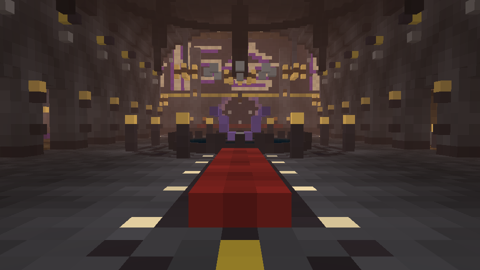
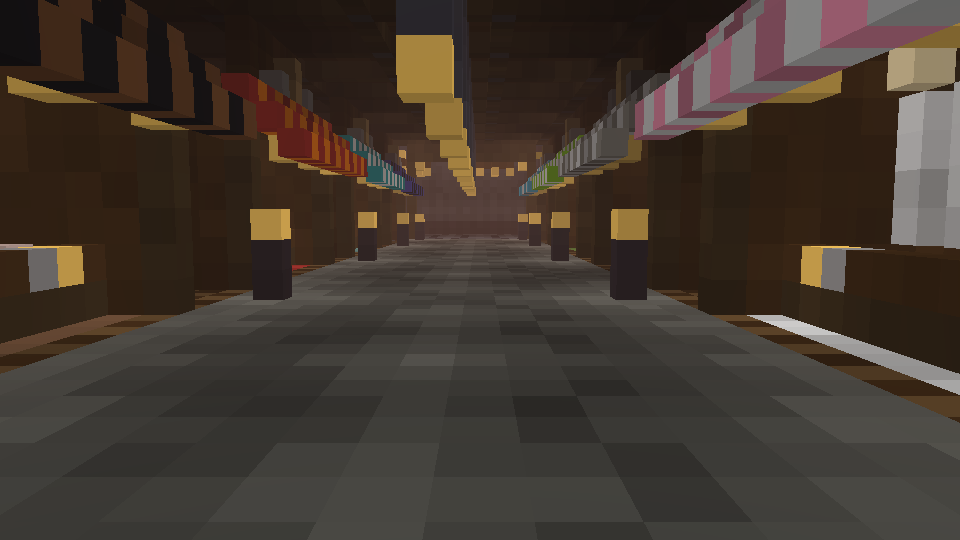
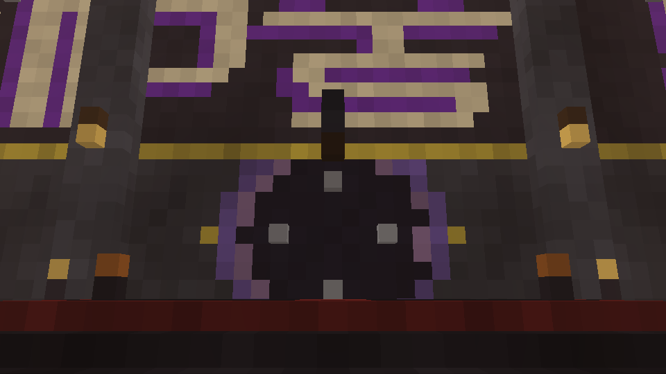
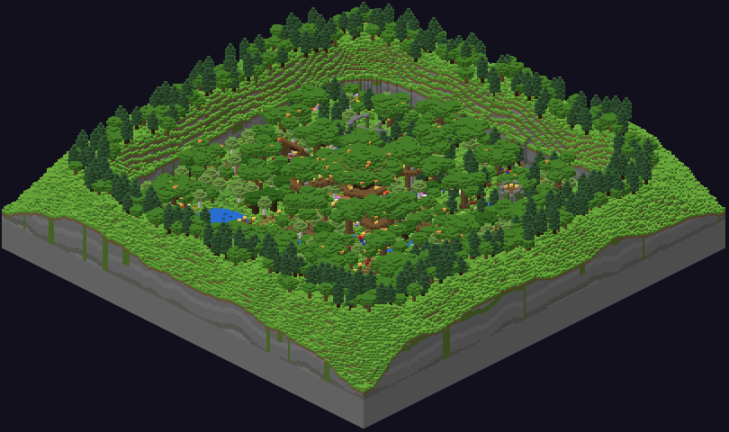
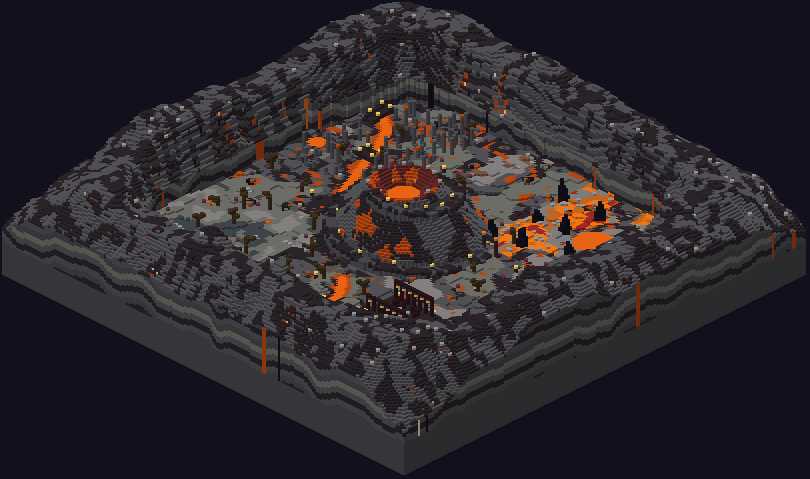
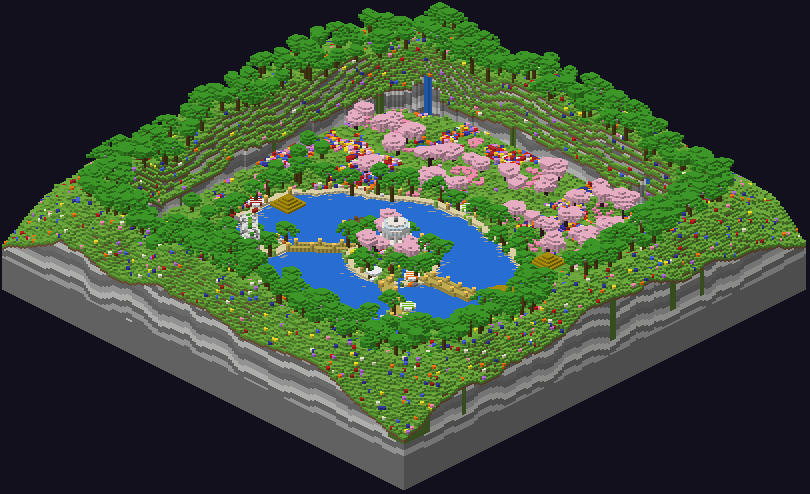
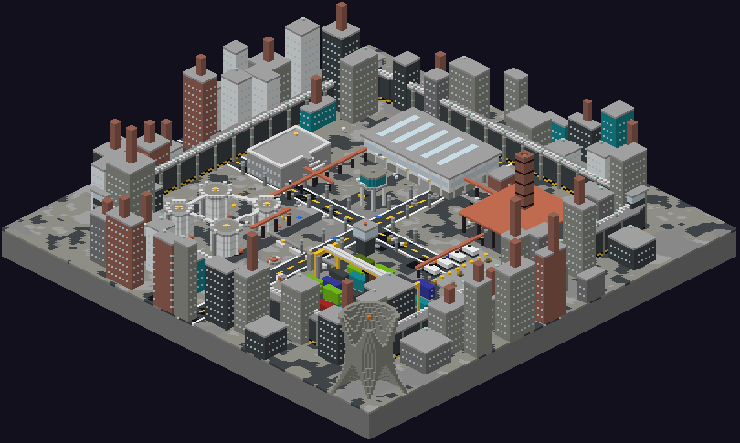
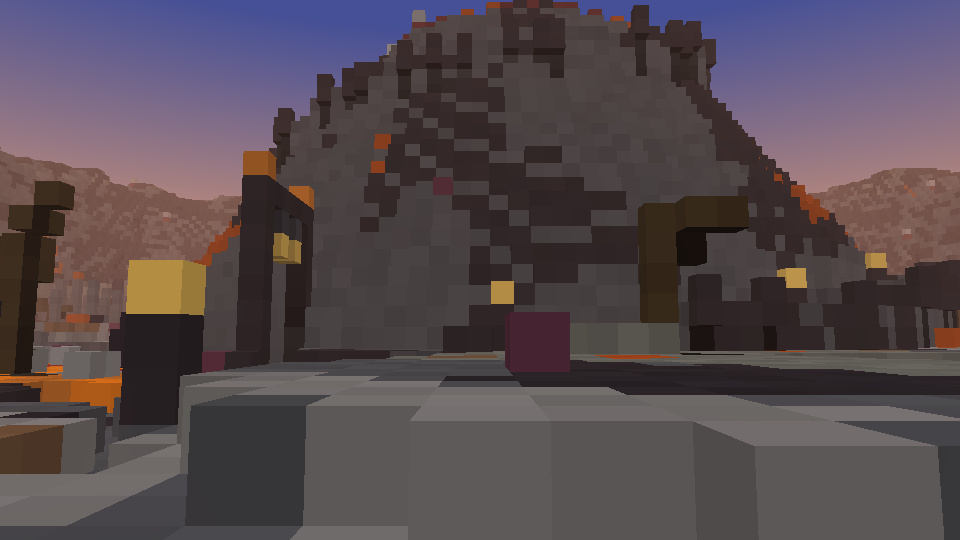
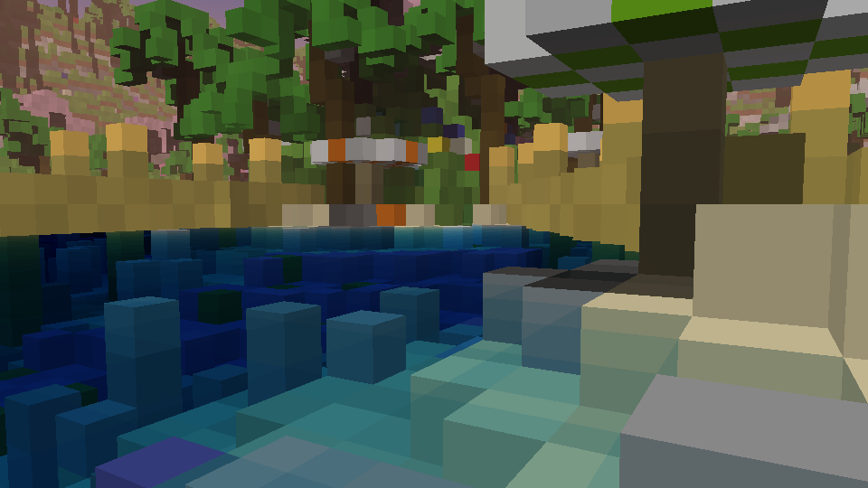

# 능력 술래잡기 (Ability Tag) — Minecraft Bedrock 맵

`AbilityTag.mcworld` 파일 하나로 바로 열 수 있는 베드락 에디션 월드입니다.
로비 1개와 게임 맵 4개(숲 · 화산 · 파라다이스 · 공장)가 들어 있고, 능력 상점과 코인 시스템이 동작합니다.

- **설치**: `AbilityTag.mcworld`를 더블클릭하거나 휴대폰/콘솔에서 "열기 → Minecraft"로 실행하면 자동으로 월드 목록에 추가됩니다.
- **테스트한 버전**: Bedrock Dedicated Server 1.26.52(현재 최신 정식)에서 실제로 불러와 검증했습니다. 1.21.60 이상이면 열립니다.
- **기본 설정**: 모험 모드, 평화로움, 치트 ON(NPC·함수 때문), 시간은 노을(12000)에 고정, 날씨 고정, 몹 스폰 OFF,
  낙하/화염/익사/동결 데미지 OFF, 인벤토리 유지, 즉시 리스폰, 무작위 틱 0(풀·산호·용암 등이 변하지 않음).



## 로비 (스폰 `0 64 41`)

어두운 딥슬레이트/흑암 홀에 조명을 배치했습니다. 바닥 밝기는 대부분 5~10이고, 상점과 무대 주변만 더 밝습니다.
조명 시뮬레이션으로 확인했을 때 가장 어두운 바닥도 밝기 3 이상이라 완전히 깜깜한 곳은 없습니다.

| 구역 | 내용 |
|---|---|
| 현관(남쪽) | 스폰 지점(나침반 문양), 환영·규칙 표지판, 장식 철문, 화분 나무 |
| 중앙 홀 | 레드카펫, 유리 돔 아래 분수, 보라색 신호기 빛줄기 + 자수정 크리스탈, 샹들리에, 기둥 회랑 |
| 무대(북쪽) | 대형 픽셀 타이틀 "능력 술래잡기", 룬 서클, **게임 시작 NPC** (`0.5 66 -40.5`), 소울 화로, 능력 오브 2개 |
| 능력 상점가(서쪽) | 상인 NPC가 있는 노점 8곳. 능력마다 줄무늬 차양, 간판, 장식이 다름 |
| 맵 갤러리(동쪽) | 맵 4개의 디오라마 창문, 라운지 소파, 안내 게시판 |

- 게임 시작 NPC는 요청대로 **엔티티만** 소환했습니다. 이름은 `▶ 게임 시작 ◀`, 태그는 `start_npc`입니다.
  대화나 커맨드는 연결하지 않았으니 원하는 게임 시작 로직에 연결하면 됩니다.
  예: NPC 편집 화면에서 버튼 커맨드를 넣거나, `@e[tag=start_npc]`로 대상을 지정할 수 있습니다.
- NPC는 월드를 처음 열 때 행동 팩이 자동으로 한 번만 소환합니다. 다시 열어도 중복으로 생기지 않는 것을 확인했습니다.

### 능력 상점 (코인 구매, 능력 1개만 장착)

| id | 능력 | 가격 | 효과(게임 시작 시 `function at/ability/apply`로 적용) |
|---|---|---|---|
| 1 | 신속 | 60 | 신속 II, 게임 내내 |
| 2 | 도약 | 50 | 점프 강화 II, 게임 내내 |
| 3 | 투명화 | 80 | 투명화 30초 |
| 4 | 깃털 | 40 | 느린 낙하 + 점프 강화 I |
| 5 | 올빼미 눈 | 25 | 야간 투시 |
| 6 | 인어 | 40 | 전달체의 힘 + 신속 I |
| 7 | 폭주 | 70 | 신속 IV + 점프 강화 III, 15초 |
| 8 | 사냥꾼 | 70 | 신속 I + 야간 투시 |

- 상인 NPC를 누르면 대화창에서 **구매하기**와 **내 코인 확인** 버튼이 나옵니다.
- 처음 입장한 플레이어에게 200코인이 지급됩니다. 코인은 사이드바에 표시됩니다.
- 사용하는 스코어보드: `coin`(보유 코인), `ability`(장착한 능력 id, 0은 없음)

### 게임 로직에 쓸 수 있는 함수

| 함수 | 설명 |
|---|---|
| `function at/ability/apply` | 실행한 플레이어(@s)에게 장착한 능력 효과를 적용 (라운드 시작 시) |
| `function at/ability/clear` | 효과 전부 제거 |
| `function at/ability/reset` | 장착한 능력 해제 |
| `function at/coin/add10` / `add50` / `add100` | @s에게 코인 지급 |
| `function at/tp/lobby` | 로비로 이동 |
| `function at/tp/forest` · `volcano` · `paradise` · `factory` | 각 맵의 기본 스폰으로 이동 (`_1` ~ `_3`은 맵별 스폰 3곳) |

예: `execute as @a run function at/tp/volcano` 다음에 `execute as @a run function at/ability/apply`

### 맵 이동 아이템 (우클릭하면 바로 TP)

플레이어가 스폰할 때마다 빠진 이동 아이템을 핫바 5~9번 칸에 자동으로 채워줍니다.
아이템을 들고 우클릭하면(모바일은 길게 누르기) 바로 순간이동합니다. 블록을 보고 눌러도 동작합니다.

| 핫바 칸 | 아이템 | 이름 | 도착 위치 |
|---|---|---|---|
| 5 | 네더의 별 | 로비 (스폰)으로 이동 | 로비 스폰 `0 64 41` (무대를 바라봄) |
| 6 | 에메랄드 | 1. 숲으로 이동 | `1035 67 0` (세계수를 바라봄) |
| 7 | 블레이즈 가루 | 2. 화산으로 이동 | `46 66 1018` (화산을 바라봄) |
| 8 | 바다의 심장 | 3. 파라다이스로 이동 | `-1024 69 -46` (석호를 바라봄) |
| 9 | 철 주괴 | 4. 공장으로 이동 | `0 65 -1016` (창고 쪽을 바라봄) |

- 이름이 붙은 아이템만 반응합니다. 같은 종류라도 이름이 없는 일반 아이템은 아무 일도 일어나지 않습니다.
- 버리거나 상자에 넣을 수 없고(인벤토리 잠금), 죽어도 사라지지 않습니다. 연속 이동을 막는 1초 쿨타임이 있습니다.
- 원하는 칸이 이미 차 있으면 비어 있는 다른 칸에 들어갑니다.

| 함수 | 설명 |
|---|---|
| `function at/items/give` | 실행한 플레이어(@s)에게 빠진 이동 아이템 지급 (콘솔·커맨드 블록에서 실행하면 전원) |
| `function at/items/clear` | 이동 아이템 회수 |
| `function at/items/auto_off` / `auto_on` | 스폰할 때 자동 지급 끄기 / 켜기 (기본: 켜짐) |

예: 게임 중에는 이동을 막고 싶다면 라운드 시작 때 `execute as @a run function at/items/clear`와
`function at/items/auto_off`을, 끝난 뒤 `function at/items/auto_on`과 `execute as @a run function at/items/give`를 실행하면 됩니다.
이 기능은 `@minecraft/server` 1.11.0 스크립트로 동작합니다. 실험적 기능을 켤 필요는 없습니다.

## 게임 맵 (로비에서 1024블록씩 떨어져 있음, 플레이 영역은 약 152×152)

| 맵 | 중심 | 스폰 1 / 2 / 3 | 특징 | 경계 벽 |
|---|---|---|---|---|
| 1. 숲 | `1024, 0` | `1035 67 0` / `1013 67 0` / `1024 67 12` | 속이 빈 거대 세계수(나선 계단, 2층 전망대, 다리 3개로 이어진 나무 위 데크), 시냇물과 다리, 연못과 부두, 폐허 감시탑, 오두막, 캠프장, 고대 유적, 거대 참나무 숲 | 이끼 낀 암벽 절벽 위로 나무숲, 절벽에서 쏟아지는 샘 폭포 |
| 2. 화산 | `0, 1024` | `46 66 1018` / `44 66 1030` / `-46 65 1030` | 나선 도로로 오르는 화산과 분화구 용암호(계단식이라 빠져도 나올 수 있음), 화산 아래 용암 터널, 용암 강과 흑암 다리, 현무암 기둥 숲, 흑요석 첨탑, 불의 신전, 화산재 평원(연기 분출구) | 현무암·흑암 절벽, 마그마 줄기, 용암 폭포 3곳 |
| 3. 파라다이스 | `-1024, 0` | `-1024 69 -46` / `-1036 68 -44` / `-1012 70 -44` | 청록빛 석호(따뜻한 바다 바이옴)와 산호초, 중앙 섬 대리석 정자, 벚꽃 언덕, 야자수 해변, 대나무 보드워크, 티키 바, 비치 오두막과 파라솔, 인명구조 탑, 천연 바위 아치 | 방해석·섬록암 열대 절벽, 정글 덤불, 폭포 4곳 |
| 4. 공장 | `0, -1024` | `0 65 -1016` / `8 65 -1024` / `-8 65 -1024` | 선반이 늘어선 A동 창고(복층 사무실), 굴뚝 있는 제련소, 캣워크로 이어진 탱크 4기, 겐트리 크레인이 있는 컨테이너 야적장, 하역장 트럭, 고철장, 변전소, 관리동(옥상), 급수탑, 관제탑, 배관망 | 줄무늬 콘크리트 담장, 철조망, 모서리 감시탑, 담장 밖 공장 스카이라인과 냉각탑 |

- 모든 경계 벽 위에는 **투명 방벽 블록이 높이 약 60블록까지** 둘러져 있어서, 점프 강화 같은 능력을 써도 맵 밖으로 나갈 수 없습니다.
- 화산 맵 안에 있는 플레이어에게는 행동 팩이 화염 저항을 자동으로 계속 걸어줍니다. 용암이나 마그마에 닿아도 죽지 않습니다.

## "2칸 이상 갇히는 공간 없음" 검증

모험 모드 플레이어의 움직임을 시뮬레이션하는 검사기(`generator/trapcheck.py`)로 모든 맵을 확인했습니다.
검사기는 키 1.8블록, 점프로 최대 1블록 오르기, 아무 높이에서나 떨어지기, 수영, 사다리·덩굴·비계 오르기를 반영합니다.
스폰에서 갈 수 있는 모든 위치가 다시 스폰으로 돌아올 수 있는지, 그리고 맵 밖으로 나갈 수 있는 위치가 없는지 확인했습니다.

| 영역 | 갈 수 있는 위치 수 | 갇히는 위치 | 맵 밖으로 나가는 위치 |
|---|---|---|---|
| 로비 | 10,194 | 0 | 0 |
| 숲 | 23,816 | 0 | 0 |
| 화산 | 21,837 | 0 | 0 |
| 파라다이스 | 41,221 | 0 | 0 |
| 공장 | 20,855 | 0 | 0 |

추가로 Bedrock 전용 서버에서 각 맵을 60초 동안 실제로 돌린 뒤 저장된 블록을 원본과 비교했습니다.
용암·물이 흘러넘치거나, 풀·잎·산호가 변하거나, 불이 번지는 일은 없었습니다.
달라진 것은 게임이 최신 블록 형식으로 자동 변환한 부분(쇠사슬 이름, 계단 모서리, 울타리·유리판 연결 상태)뿐입니다.

## 시간 바꾸기

`/time set 6000`(낮), `/time set 18000`(밤)처럼 바꾸면 됩니다. 시간 흐름은 꺼져 있어서 바꾼 시간이 그대로 유지됩니다.

## 다시 만들기 (선택)

`generator/` 폴더의 파이썬 스크립트로 월드 전체가 만들어집니다.

```bash
pip install -r generator/requirements.txt
python generator/build.py .        # -> ./AbilityTag.mcworld
```

- `mcw.py`: LevelDB/청크/블록 팔레트 저장. 모든 블록 상태는 Bedrock 공식 블록 목록으로 검증합니다.
- `gen_lobby.py`, `gen_forest.py`, `gen_volcano.py`, `gen_paradise.py`, `gen_factory.py`: 로비와 각 맵
- `pack.py`: 행동 팩(NPC 소환, 상점 대화, 함수) · `tp_items.js`: 이동 아이템 스크립트 · `abilities.py`: 능력 목록과 가격
- `trapcheck.py`: 갇힘 검사기 · `lighting.py`: 조명 시뮬레이션 · `render.py`: 미리보기 렌더러

## 미리보기

| | |
|---|---|
|  |  |
|  |  |
|  |  |
|  |  |
