# 아홉 세계의 항해 — 노르드 신화 RPG (Minecraft Bedrock 맵)

`NorseRPG.mcworld` 하나에 항구 마을(스폰)과 던전 10개, 보스 22마리가 들어 있는 베드락 에디션 RPG 월드입니다.
북유럽 신화의 아홉 세계를 배로 항해하며, 앞 던전을 깨야 다음 항로가 열립니다.
보스 전용 **행동 팩**과 **리소스 팩**이 월드 안에 들어 있어서 따로 설치할 것이 없습니다.

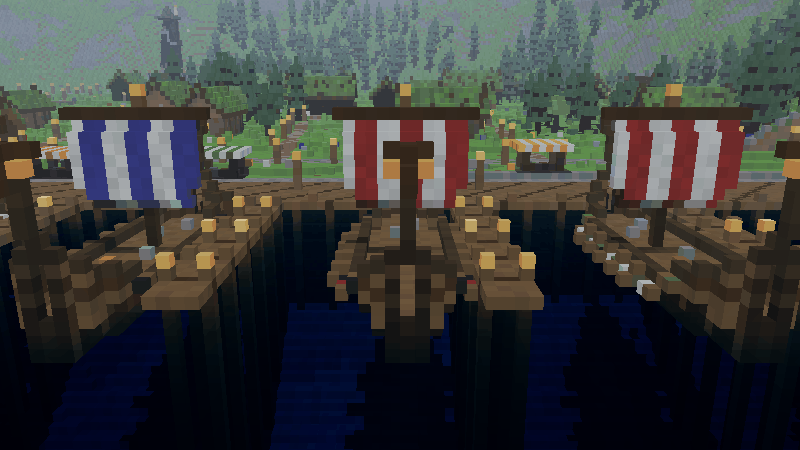

- **설치**: `NorseRPG.mcworld`를 더블클릭하거나 휴대폰/콘솔에서 "열기 → Minecraft"로 열면 월드 목록에 추가됩니다.
  두 팩은 월드에 붙어 있으니 그대로 플레이하면 됩니다.
- **전용 서버(BDS)**: 압축을 풀어 `worlds/` 폴더에 넣고 `server.properties`의 `level-name`을 그 폴더 이름으로 바꾸세요.
  보스 모델과 바닥 경고 표시가 보이려면 리소스 팩이 필요하니 `texturepack-required=true`로 두는 것을 권합니다.
- **팩만 따로 필요할 때**: `NorseRPG_behavior.mcpack`(행동 팩), `NorseRPG_resources.mcpack`(리소스 팩).
  월드에 이미 들어 있으므로 보통은 필요 없습니다. 다른 월드에 붙이면 좌표가 맞지 않으니 이 월드 전용입니다.
- **필요 버전**: 1.21.90 이상. 스크립트는 `@minecraft/server` 2.0.0, `@minecraft/server-ui` 2.0.0(정식 API)만 씁니다.
  실험적 기능을 켤 필요가 없습니다. Bedrock Dedicated Server 1.26.52에서 불러와 시험했습니다.
- **기본 설정** (`level.dat`, 서버에서 바꿔도 됩니다)
  - 모험 모드(블록을 부수거나 놓을 수 없음), 난이도 보통, 낮밤 순환 켜짐, 날씨 맑음 고정
  - 낙하·화염·익사·동결 피해 켜짐, PvP 꺼짐, 좌표 표시 켜짐, 무작위 틱 속도 1
  - **인벤토리 유지 켜짐**(강화한 장비를 죽어서 잃지 않게), 즉시 리스폰, 죽으면 항구에서 다시 시작
  - **자연 몹 스폰 꺼짐**: 몬스터는 스크립트가 사냥터에서만 소환합니다. 몹 그리핑·불 번짐·TNT 폭발 꺼짐(맵이 부서지지 않음)
  - 몹 전리품 켜짐(보스 전리품), 치트 켜짐(관리자 명령용)
  - 처음 들어온 플레이어는 항구 도착 지점으로 옮겨지고 기본 장비(철 검, 활, 화살 48, 방패, 사슬 갑옷 한 벌, 빵,
    귀환 주문서 3, 룬 조각 8, 모험가의 수첩)를 받습니다.

## 진행 방식

```
미드가르드 항구 ── 배에 오름 ──▶ 던전 상륙 지점
                                    │
                    전투 구역 1 → 2 → 3 (중간 보스 1) → 4 → 5 (중간 보스 2) → 6
                                    │
                               최종 보스 방 ── 처치 ──▶ 룬 원(출구) ──▶ 항구로 귀환, 다음 항로 개방
```

- 던전은 모두 **시작 지역 → 전투 구역 6곳 → 최종 보스** 순서입니다.
  중급부터는 3번째 구역과 5번째 구역 끝에 **중간 보스**가 있고, 쓰러뜨려야 다음 구역 문이 열립니다.
- 보스 방에 들어서면 들어온 문이 닫히고(쇠창살 등) 보스가 나타납니다. 쓰러뜨리면 들어온 문과 다음 문이 함께 열립니다.
- 싸우는 도중 방 근처에 20초 동안 아무도 없으면(전원이 죽거나 귀환) 방이 처음 상태로 돌아가 다시 도전할 수 있습니다.
  쓰러뜨린 방은 5분이 지나고 주변에 30초 이상 아무도 없을 때 보스가 다시 준비됩니다.
- 최종 보스를 쓰러뜨릴 때 보스 방 안에 있던 플레이어 모두에게 그 던전이 **클리어**로 기록되고, 항구에서 다음 배가 열립니다.
  클리어 기록은 플레이어마다 따로 저장됩니다.
- 출구 룬 원은 최종 보스 방 문 너머에 있어서, 보스를 쓰러뜨리기 전에는 닿을 수 없습니다(검사로 확인).

| 단계 | 던전 | 권장 | 크기 | 특징 |
|---|---|---|---|---|
| 초급 | 1~4 | Lv.1-4 | 176 × 288칸 | 작은 해안·숲·동굴·산. 보스 1마리 |
| 중급 | 5~7 | Lv.5-7 | 272 × 448칸 | 크고 성 같은 구조(성벽, 탑, 성문, 대전당). 중간 보스 2 + 최종 보스 |
| 상급 | 8~10 | Lv.8-10 | 272 × 448칸 | 크고 신화적인 세계(불의 나라, 죽은 자의 나라, 무지개 다리). 중간 보스 2 + 최종 보스 |

단계가 오를수록 블록 종류, 조명, 안개 색, 날리는 입자(재·포자·영혼 불꽃 등)가 더 풍부해집니다.
던전마다 고유한 하늘·안개 색(클라이언트 바이옴)이 리소스 팩에 들어 있습니다.

## 미드가르드 항구 (스폰)

눈 덮인 산과 바다 사이 피오르에 자리한 항구 마을 **비크**입니다. 512 × 800칸, 도착 지점 `-14 65 132`.

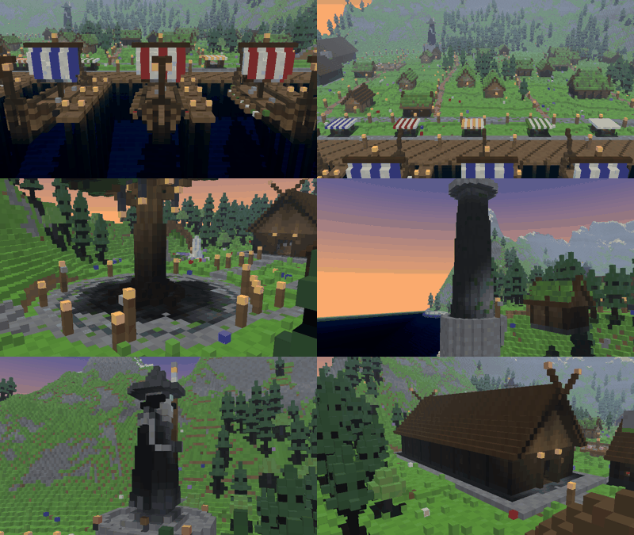

| 장소 | 내용 |
|---|---|
| 부두와 롱쉽 10척 | 던전마다 배가 한 척씩 정박해 있습니다. 돛 색으로 단계를 구분합니다: 초급 흰 돛 + 빨간 줄, 중급 흰 돛 + 파란 줄, 상급 검은 돛 + 노란 줄. 배 앞 표지판에 던전 이름과 권장 레벨 |
| 상륙장 | 처음 도착하고 귀환할 때 서는 룬 원과 선착장 |
| 세계수 광장 | 가운데 거대한 세계수, 벤치, 안내 표지판 |
| 룬 대장간 | **강화 모루**가 있는 대장간(용광로, 화덕, 숫돌, 대장장이 작업대, 물통) |
| 노른의 샘 | 세 노른(우르드·베르단디·스쿨드) 석상이 둘러싼 샘. **일일보상** |
| 대연회장 | 용머리 장식을 엇갈려 올린 바이킹 장옥. 기둥 회랑, 긴 식탁, 불 도랑, 옥좌 |
| 오딘 석상 | 언덕 위 지팡이를 든 외눈의 방랑자 |
| 훈련장 | 허수아비 4개(때리면 받은 피해가 머리 위에 표시되고 2초 뒤 회복) |
| 등대 | 바다 쪽 해안의 돌 등대 |
| 그 밖에 | 집, 시장 노점(줄무늬 차양), 길과 가로등, 숲, 폭포 |

- **맵 밖으로 나가기 방지**: 항구 둘레는 투명 방벽과 경계 블록으로 막혀 있습니다.
  그래도 영역을 벗어나거나 던전에서 바닥 아래로 떨어지면 스크립트가 항구 또는 던전 시작 지점으로 되돌려 보냅니다.

## 시스템

### 항해와 귀환

- **출항**: 배 갑판에 올라서면 던전 소개(이름, 단계, 권장 레벨, 구역 목록)와 **출항한다** 버튼이 나옵니다.
  잠긴 던전은 어떤 던전을 먼저 깨야 하는지 알려 줍니다. 창을 닫았으면 갑판에서 웅크리면 다시 열립니다.
- **귀환 방법 4가지**
  - 던전 시작 지점의 **귀환선** 갑판에 오르기
  - 최종 보스 뒤 **룬 원**에 들어서기
  - **귀환 주문서** 사용: 5초 동안 가만히 있으면 귀환(움직이거나 맞으면 취소, 주문서 1장 소모)
  - **모험가의 수첩** → "항구로 귀환": 10초, 무료
- 수첩에서는 던전 진행도(✔ 클리어 / ▶ 도전 가능 / ✖ 잠김), 재료 개수, 일일보상 연속 일수, 게임 안내를 볼 수 있습니다.

### 룬 강화 (대장간 모루)

강화할 무기나 방어구를 **손에 들고** 대장간 모루를 누르면 강화 창이 열립니다. +10까지 올릴 수 있습니다.

| 단계 | 0→1 | 1→2 | 2→3 | 3→4 | 4→5 | 5→6 | 6→7 | 7→8 | 8→9 | 9→10 |
|---|---|---|---|---|---|---|---|---|---|---|
| 성공 확률 | 100% | 95% | 90% | 80% | 70% | 60% | 50% | 42% | 35% | 30% |
| 룬 조각 | 2 | 4 | 6 | 8 | 10 | 12 | 14 | 16 | 18 | 20 |
| 룬 정수 | - | - | - | - | - | 2 | 3 | 4 | 5 | 6 |
| 실패하면 | 유지 | 유지 | 유지 | 유지 | 유지 | 유지 | 1단계 하락 | 하락 70% / 파괴 30% | 〃 | 〃 |

- **보호 주문서**를 갖고 있으면 +6부터 "보호 주문서를 쓰고 강화" 버튼이 나옵니다. 실패해도 단계가 내려가거나 부서지지 않습니다.
- 강화 단계마다 마법 부여가 자동으로 붙습니다.
  - 근접 무기: 날카로움 1~5, 내구성 1~3, 발화 1~2(+6, +8), 약탈 1~3(+8~+10), 밀치기(+9)
  - 활: 힘 1~5, 내구성, 밀어내기 1~2, 화염(+7), 무한(+10) · 쇠뇌: 빠른 장전, 관통, 다중 발사(+10) · 삼지창: 찌르기, 충성, 집전(+10)
  - 방어구: 보호 1~4, 내구성, 가시 1~3(+8~+10), 투구 호흡(+6), 장화 가벼운 착지(+4~+10)
- 이름이 `+7 다이아몬드 검`처럼 바뀌고 색이 단계에 따라 달라집니다(+1~3 연두, +4~6 하늘, +7~9 보라, +10 금색).
  +8 이상 성공하면 서버 전체에 알림이 나갑니다.

### 일일보상 (노른의 샘)

하루 한 번, 한국 시간 자정에 초기화됩니다. 연속으로 받으면 7일 주기로 보상이 커집니다(하루 빠지면 1일차부터).

| 1일차 | 2일차 | 3일차 | 4일차 | 5일차 | 6일차 | 7일차 |
|---|---|---|---|---|---|---|
| 룬 조각 4, 빵 8 | 룬 조각 6, 귀환 주문서 1 | 룬 조각 8, 황금 당근 8 | 룬 조각 8, 룬 정수 1 | 룬 조각 10, 보호 주문서 1 | 룬 조각 12, 귀환 주문서 2, 화살 32 | 룬 조각 16, 룬 정수 2, 보호 주문서 1, 황금 사과 2 |

### 재료 얻기

| 출처 | 보상 |
|---|---|
| 사냥터 몬스터 | 35% 확률로 룬 조각 1~2 |
| 중간 보스 | 룬 조각(중급 4~5 / 상급 6~7), 룬 정수 1, 경험치 레벨, 전리품 |
| 최종 보스 | 룬 조각(초급 4~6 / 중급 8~10 / 상급 12~14), 룬 정수(1 / 2 / 3), 상급은 보호 주문서 1, 경험치 레벨, 전리품(황금 사과, 철 또는 다이아몬드, 에메랄드, 경험치 병) |

### 사냥터 몬스터

- 던전마다 어울리는 몬스터 4~5종이 있고, 전투 구역마다 그중 2~3종이 나옵니다(예: 드라우그 전사, 철숲 늑대, 황금에 미친 광부, 해골 선원, 무스펠 불꽃, 헬의 기사).
- 플레이어가 구역 근처에 오면 9~44칸 떨어진 자리에 나타나고, 사람이 많으면 최대 수가 늘어납니다.
  아무도 없는 구역의 몬스터는 1분 뒤 사라집니다. 자연 스폰 몬스터와 섞이지 않습니다.
- 중급은 체력 증가 II + 힘 I, 상급은 체력 증가 IV + 힘 II + 저항 I이 붙습니다. 모든 몬스터는 화염 저항이 있어 낮에도 타지 않습니다.

### 보스 기술과 바닥 경고

**모든 보스 기술은 맞기 전에 바닥에 범위와 경로가 먼저 그려집니다.**

- 조준형 기술(직선, 부채꼴, 돌진)은 처음에 **주황색**으로 플레이어를 따라오다가, 경로가 고정되면 보스 고유 색으로 바뀝니다.
- 표시 안쪽이 가운데부터 차오르다 가득 차는 순간 피해가 들어갑니다. 그 전에 표시 밖으로 나가면 피할 수 있습니다.
- 직선·돌진 기술은 지나가는 경로 전체와 끝의 착탄 표시(이중 원 + 십자)가 함께 그려집니다.
- 표시는 조명을 받지 않고 밝게 빛나서 어두운 방에서도 잘 보입니다.
- 체력이 줄면 다음 페이즈로 넘어가 새 기술이 섞입니다. 초급 보스와 중간 보스는 50%에서, 중급·상급 최종 보스는 66%와 33%에서 바뀝니다.

| 모양 | 설명 |
|---|---|
| 직선 | 보스 시선 방향으로 뻗는 긴 띠 |
| 부채꼴 | 앞쪽 부채꼴 |
| 원형 | 보스 주위 원 |
| 고리 | 도넛 모양(안쪽은 안전) |
| 방사 | 보스 주위로 뻗는 여러 줄기(십자·별), 회전하기도 함 |
| 발밑 | 모든 플레이어 발밑에 원 |
| 낙하 | 방 곳곳에 원이 차례로 떨어짐 |
| 돌진 | 대상까지 이어진 띠, 보스가 그 길로 돌진(여러 번 반복하기도) |
| 도약 | 대상 위치에 원, 보스가 거기로 착지 |
| 흡인 | 큰 원으로 끌어당긴 뒤 가운데 작은 원이 폭발 |
| 파동 | 바깥으로 차례로 퍼지는 고리 |
| 휩쓸기 | 방을 가로지르는 평행한 띠 여러 줄 |
| 소환 | 졸개가 기어 나올 자리에 작은 원 |
| 분신 | 환영이 나타나 각자 조준 광선을 쏨 |

## 던전

| # | 던전 | 단계 | 세계 | 전투 구역 (1→6) | 중간 보스 | 최종 보스 |
|---|---|---|---|---|---|---|
| 1 | 안개 해안의 고분 | 초급 | 미드가르드 | 부서진 롱쉽 해안 · 룬스톤 언덕 · 고분 들판 · 무덤 입구 협곡 · 지하 묘실 회랑 · 순장품 보관실 | | 고분왕 아르나르 |
| 2 | 철의 숲 야른비드 | 초급 | 미드가르드 동쪽 끝 | 녹슨 나무길 · 늑대 굴 · 뼈의 공터 · 덩굴 협곡 다리 · 앙그르보다의 오두막 · 달빛 고목 | | 하티 |
| 3 | 안드바리의 황금 동굴 | 초급 | 스바르트알프헤임 입구 | 물보라 동굴 · 이끼 광맥 · 수정 갱도 · 지하 호수 다리 · 저주받은 금화 창고 · 안드바리의 대장간 | | 안드바리 |
| 4 | 흐룽그니르의 돌산 | 초급 | 요툰헤임 국경 | 돌다리 길 · 석화된 트롤 계곡 · 밧줄 다리 절벽 · 트롤 사냥꾼의 폐허 · 버섯 동굴 · 뼈 무더기 소굴 | | 흐룽그니르 |
| 5 | 나글파르 조선 요새 | 중급 | 세계의 끝 해안 | 외곽 부두 창고 · 성벽 순찰로 · 손톱 제련소 · 사슬 승강장 · 거대 건조 독 · 나글파르 갑판 | 나글파리, 흐레스벨그 | 흐림 |
| 6 | 우트가르드 거인 성채 | 중급 | 요툰헤임 | 스크리미르의 장갑 · 외성 마당 · 먹기 시합장 · 경주 회랑 · 뿔잔 연회장 · 환영의 회랑 | 로기, 엘리 | 우트가르다 로키 |
| 7 | 니다벨리르 대장간 성채 | 중급 | 니다벨리르 | 광석 운반로 · 용광로 구역 · 풀무 탑 · 보물 진열 회랑 · 담금질 수로 · 룬 각인실 | 브로크, 에이트리 | 파프니르 |
| 8 | 무스펠헤임 불꽃의 문 | 상급 | 무스펠헤임 | 용암 강 다리 · 현무암 숲 · 무스펠 전초기지 · 분화구 계단 · 흑요석 신전 · 불칼 대장간 | 무스펠손, 신마라 | 수르트 |
| 9 | 헬헤임 걀라르 다리 | 상급 | 헬헤임 | 가시 숲 · 걀 강 해안 · 걀라르 다리 · 헬그린드 · 그니파 동굴 · 나스트론드 | 모드구드, 가름 | 헬 |
| 10 | 비프로스트와 신들의 황혼 | 상급 | 아스가르드 | 무지개 다리 · 히민비요르그 · 세계의 바다 성벽 · 황금 방패 회랑 · 이다볼 평원 · 불타는 위그리드 | 요르문간드, 로키 | 펜리르 |

던전마다 볼거리:

1. **안개 해안의 고분** — 안개 낀 회색 해안, 부서진 롱쉽 잔해, 룬스톤, 무덤 언덕 아래 지하 묘실과 고분왕의 왕좌실.
2. **철의 숲 야른비드** — 쇠처럼 검은 고목 숲, 늑대 굴, 덩굴 협곡의 흔들다리, 마녀 앙그르보다의 오두막, 달이 걸린 바위 언덕.
3. **안드바리의 황금 동굴** — 폭포 뒤로 들어가는 동굴, 이끼 광맥, 자수정 갱도, 아치 다리가 놓인 지하 호수, 금화가 쌓인 저장고.
4. **흐룽그니르의 돌산** — 햇빛에 굳은 트롤 석상들이 선 계곡, 절벽 밧줄 다리, 거대 버섯 동굴, 산꼭대기 결투장.
5. **나글파르 조선 요새** — 검은 해안의 성벽 요새, 성벽 위 순찰로, 손톱 제련소와 용광로 마당, 사슬 승강장, 거대한 건조 독에 누운 망자의 배 나글파르(갑판과 함교가 보스 방).
6. **우트가르드 거인 성채** — 모든 것이 거인 크기인 성: 산만 한 장갑 스크리미르, 거인 술통, 먹기 시합장, 경주 회랑, 뿔잔 연회장, 환영의 회랑과 옥좌.
7. **니다벨리르 대장간 성채** — 난쟁이 얼굴이 새겨진 산문, 광차 레일, 유리 아래 흐르는 용암 용광로, 풀무 탑, 보물 진열 회랑, 룬 각인실, 금화가 쌓인 용의 동굴.
8. **무스펠헤임 불꽃의 문** — 재의 해안과 용암 강, 현무암 숲, 불의 거인 전초기지와 성채, 분화구 계단, 흑요석 신전, 거대한 불칼을 벼리는 대장간, 용암 해자에 둘러싸인 옥좌.
9. **헬헤임 걀라르 다리** — 칼날 강 걀의 깊은 협곡을 건너는 금빛 지붕 다리, 헬의 문 헬그린드, 가름의 동굴, 독이 떨어지는 나스트론드, 반은 살아 있고 반은 죽은 궁전 엘류드니르.
10. **비프로스트와 신들의 황혼** — 하늘에 뜬 섬들을 잇는 무지개 다리, 하늘의 파수대 히민비요르그, 세계뱀을 막는 바다 성벽, 황금 방패 지붕의 발할라 회랑, 이다볼 평원, 불타는 위그리드 들판과 마지막 결전.

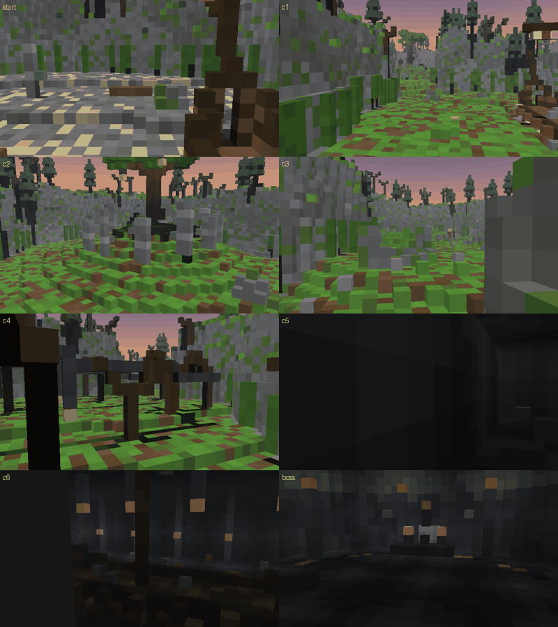

## 보스 22마리

보스 모델·텍스처·애니메이션은 모두 직접 만든 것으로 리소스 팩에 들어 있습니다. 괄호 안은 바닥 경고 모양입니다.

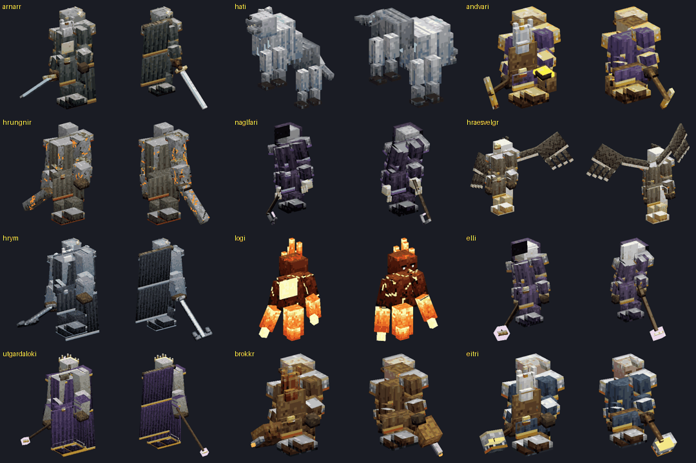
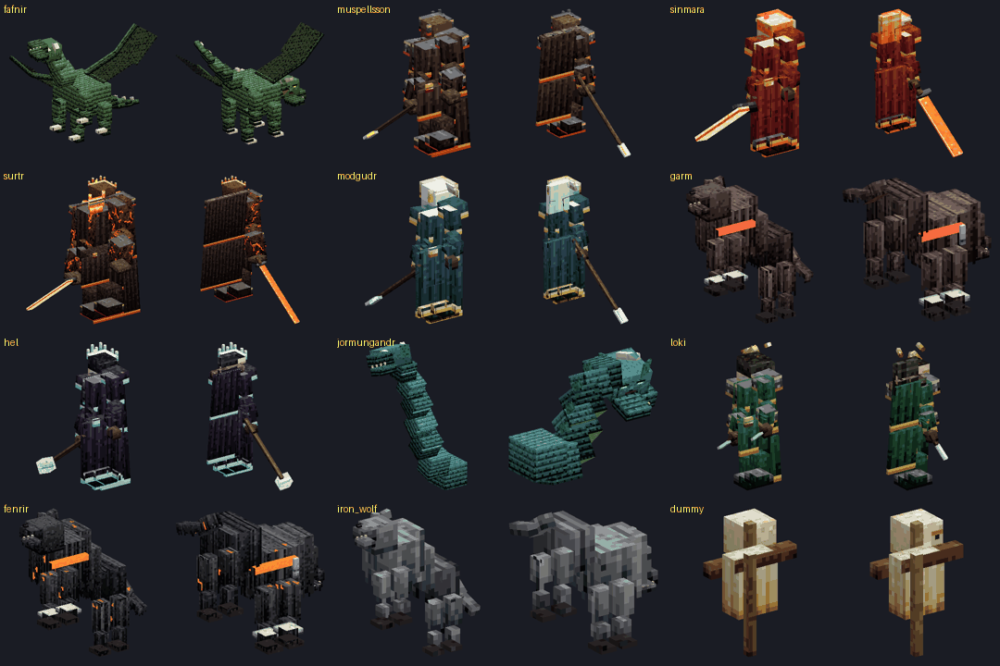

| 던전 | 역할 | 보스 | 체력 | 기술 |
|---|---|---|---|---|
| 1 | 최종 | 고분왕 아르나르 · 망자들의 왕 | 360 | 망자의 검기(직선), 무덤 강타(원형), 고분의 부름(소환), 저주의 원(발밑) |
| 2 | 최종 | 하티 · 달을 쫓는 늑대 | 420 | 달그림자 돌진(돌진), 할퀴기(부채꼴), 달빛 도약(도약), 월광 포효(고리), 늑대 무리(소환) |
| 3 | 최종 | 안드바리 · 저주받은 황금의 난쟁이 | 400 | 황금 낙석(낙하), 저주의 반지 광선(직선), 물의 소용돌이(흡인), 황금 폭발(원형), 도둑맞은 금화(발밑) |
| 4 | 최종 | 흐룽그니르 · 돌 심장의 거인 | 520 | 숫돌 투척(직선), 대지 강타(파동), 바위 던지기(발밑), 산사태(낙하), 거인의 돌진(돌진) |
| 5 | 중간 1 | 나글파리 · 망자의 손톱을 모으는 자 | 600 | 손톱 비(낙하), 갈고리 사슬(직선), 세 갈래 할퀴기(부채꼴), 죽음의 원(고리) |
| 5 | 중간 2 | 흐레스벨그 · 바람을 일으키는 독수리 거인 | 700 | 폭풍 날개(휩쓸기), 급강하(도약), 깃털 화살(발밑), 회오리(고리) |
| 5 | 최종 | 흐림 · 나글파르의 선장 | 1100 | 닻 내려치기(원형), 닻 사슬 투척(직선), 갑판 쓸기(부채꼴), 망자의 선원(소환), 서리 파도(파동), 나글파르의 포격(낙하), 닻사슬 십자(방사) |
| 6 | 중간 1 | 로기 · 모든 것을 삼키는 들불 | 650 | 불길 삼키기(흡인), 불꽃 줄기(방사), 화염 장판(발밑), 들불(고리) |
| 6 | 중간 2 | 엘리 · 늙음 그 자체 | 750 | 세월의 손아귀(발밑), 시간의 고리(고리), 노쇠(부채꼴), 흩어지는 모래(낙하) |
| 6 | 최종 | 우트가르다 로키 · 환영의 거인왕 | 1300 | 환영 분신(분신), 환영 광선(직선), 거인의 손(원형), 착각의 별(방사), 왜곡된 대지(휩쓸기), 끝없는 환영(분신), 무너지는 천장(낙하) |
| 7 | 중간 1 | 브로크 · 풀무를 밟는 난쟁이 | 700 | 풀무 돌풍(부채꼴), 망치 내려치기(원형), 불씨 날리기(낙하), 용광로 분출(방사) |
| 7 | 중간 2 | 에이트리 · 묠니르를 벼린 난쟁이 | 800 | 모루 낙하(발밑), 담금질 증기(고리), 룬 각인 광선(직선), 망치 회전(돌진) |
| 7 | 최종 | 파프니르 · 황금에 눈먼 용 | 1500 | 독의 숨결(부채꼴), 꼬리 쓸기(부채꼴), 날개 돌풍(휩쓸기), 독액 비(낙하), 황금 탐욕(도약), 용의 분노(방사) |
| 8 | 중간 1 | 무스펠손 · 불꽃의 선봉장 | 900 | 불창 투척(직선), 용암 장판(발밑), 돌격(돌진), 불꽃 회오리(고리) |
| 8 | 중간 2 | 신마라 · 레바테인을 지키는 자 | 1000 | 레바테인 광선(직선), 불의 원(파동), 운석(낙하), 불꽃 별(방사) |
| 8 | 최종 | 수르트 · 세계를 태우는 불의 거인 | 2200 | 불의 검 내려치기(직선), 검 휘두르기(부채꼴), 무스펠의 불비(낙하), 대지 붕괴(파동), 불타는 별(방사), 세계를 태우는 불꽃(휩쓸기) |
| 9 | 중간 1 | 모드구드 · 걀라르 다리의 문지기 | 950 | 다리의 심판(휩쓸기), 혼령의 창(직선), 통곡(고리), 망자의 손(발밑) |
| 9 | 중간 2 | 가름 · 헬의 문을 지키는 개 | 1050 | 피의 돌진(돌진), 물어뜯기(부채꼴), 울부짖음(고리), 사슬 끊기(원형) |
| 9 | 최종 | 헬 · 죽은 자들의 여왕 | 2400 | 죽음의 시선(직선), 반쪽의 저주(부채꼴), 망자의 군세(소환), 영혼의 비(낙하), 헬의 심판(방사), 엘류드니르의 문(고리) |
| 10 | 중간 1 | 요르문간드 · 세계를 휘감은 뱀 | 1200 | 독의 파도(휩쓸기), 독 분사(부채꼴), 몸통 박치기(돌진), 세계뱀의 포위(고리) |
| 10 | 중간 2 | 로키 · 사슬을 풀고 온 거짓의 신 | 1100 | 분신술(분신), 변신 도약(도약), 속임수의 별(방사), 불의 장난(낙하) |
| 10 | 최종 | 펜리르 · 신들의 황혼을 부르는 늑대 | 3000 | 포식(부채꼴), 폭주 돌진(돌진), 글레이프니르 끊기(파동), 라그나로크의 울부짖음(고리), 달을 삼키는 어둠(낙하), 이빨의 별(방사), 황혼의 폭풍(휩쓸기), 새끼 늑대들(소환) |

## 관리자 명령 (`/scriptevent`)

치트가 켜진 상태에서 채팅이나 서버 콘솔에 입력합니다. 플레이어 대상 명령은 실행한 플레이어(콘솔이면 첫 번째 플레이어)에게 적용됩니다.

| 명령 | 설명 |
|---|---|
| `/scriptevent nrpg:sail d05` | 그 던전 시작 지점으로 바로 이동 (`d01`~`d10`) |
| `/scriptevent nrpg:home` | 항구로 귀환 |
| `/scriptevent nrpg:clearall` | 모든 던전을 클리어로 기록(모든 항로 개방) |
| `/scriptevent nrpg:enh 7` | 손에 든 장비를 +7로 만듦 |
| `/scriptevent nrpg:test d05_boss` | 그 보스 방에 허수아비 3개를 세우고 보스를 소환해 기술을 차례로 시험. 기술 이름을 뒤에 붙이면 그 기술만 |
| `/scriptevent nrpg:status` | 보스 방 22곳의 상태를 콘솔에 출력 |
| `/scriptevent nrpg:kill d05_boss` · `nrpg:hurt d05_boss 0.5` | 보스 처치 / 체력을 비율만큼 깎기 |
| `/scriptevent nrpg:reset` | 모든 보스 방 초기화 |
| `/scriptevent nrpg:zones` · `nrpg:zonetest d05` | 사냥터 몬스터 수 출력 / 사냥터 몬스터 소환 시험(실패하면 구역과 이유 출력) |
| `/scriptevent nrpg:mobtest x y z` | 몬스터 49종을 그 자리에 한 번씩 소환해 보고 바로 지움(엔티티 이름 검사) |

보스 방 이름은 `d01_boss`~`d10_boss`, 중간 보스는 `d05_c3_mid`, `d05_c5_mid`처럼 씁니다.
모든 좌표(배 갑판, 던전 시작·귀환선·출구, 구역 범위, 보스 방 중심)는 `world_info.json`에 정리되어 있습니다.

## 검증

**걸어 보기 검사** (생성기 `nr_verify.py`, `trapcheck.py`): 던전마다 시작 지점에서 걸어서 갈 수 있는 모든 곳을 따라가 봤습니다.
용암은 지나갈 수 없는 곳으로 치고, 사다리·덩굴·물은 오르내릴 수 있는 길로 칩니다.

| 던전 | 걸어서 갈 수 있는 자리 | 빠지면 못 나오는 곳 | 맵 밖으로 나가는 길 | 보스 문 우회 |
|---|---|---|---|---|
| 1 안개 해안의 고분 | 38,090 | 0 | 0 | 없음 |
| 2 철의 숲 야른비드 | 41,110 | 0 | 0 | 없음 |
| 3 안드바리의 황금 동굴 | 27,627 | 0 | 0 | 없음 |
| 4 흐룽그니르의 돌산 | 31,799 | 0 | 0 | 없음 |
| 5 나글파르 조선 요새 | 337,440 | 0 | 0 | 없음 |
| 6 우트가르드 거인 성채 | 67,985 | 0 | 0 | 없음 |
| 7 니다벨리르 대장간 성채 | 123,433 | 0 | 0 | 없음 |
| 8 무스펠헤임 불꽃의 문 | 41,294 | 0 | 0 | 없음 |
| 9 헬헤임 걀라르 다리 | 248,007 | 0 | 0 | 없음 |
| 10 비프로스트와 신들의 황혼 | 31,419 | 0 | 0 | 없음 |

- **보스 문 우회**: 보스 문을 하나씩 열어 가며 다시 걸어 봤습니다. 중간 보스 1을 쓰러뜨리기 전에는 4번째 구역부터,
  중간 보스 2 전에는 6번째 구역부터, 최종 보스 전에는 출구 룬 원에 닿을 수 없습니다.
- 모든 사냥터·보스 방·귀환선·출구가 시작 지점에서 걸어서 닿습니다.
  몬스터 소환 지점 중 걸어서 못 가는 자리(구역당 0~3곳)는 빌드할 때 자동으로 빠집니다.
- **리소스 팩 검사** (`rp_check.py`): JSON 66개, 클라이언트 엔티티 27개의 모델·텍스처·애니메이션·렌더 컨트롤러·안개 참조를 모두 따라가 봤고, 빠진 것 0개.

**서버 시험** (Bedrock Dedicated Server 1.26.52, 가상 마인크래프트 도구 `vmc`): 완성된 `NorseRPG.mcworld`로 던전 10곳을 하나씩 시험했습니다.

| 항목 | 결과 |
|---|---|
| 확인 항목 | **48개 중 48개 통과** |
| 팩·스크립트 오류 | 0개 (월드, 행동 팩, 리소스 팩, 스크립트가 보스 방 22곳·사냥터 60곳·배 10척·던전 10곳을 읽음) |
| 게임 규칙 | 몹 전리품 켜짐, 자연 몹 스폰 꺼짐, 인벤토리 유지 켜짐, 몹 그리핑 꺼짐, PvP 꺼짐 |
| 사냥터 몬스터 | 60개 구역 모두 소환 성공, 몬스터 49종 모두 소환 성공 |
| 보스 | **22마리 모두** 허수아비를 상대로 소환 → 기술 시전 → 처치 → 전리품이 바닥에 떨어짐 |
| 바닥 경고 | 보스 기술 **107개 모두** 시전 직후 바닥에 경고 표시가 실제로 그려짐 (예: 흐림의 포격은 원 12개, 십자는 줄기 4개) |

시험하면서 고친 것: 환영술사·요툰 주술사(소환사 계열)가 엔티티 이름 오류로 나타나지 않던 것을 찾아 고쳤습니다.

**직접 확인하지 못한 것**: 시험 서버에 실제 플레이어가 접속할 수 없어서, 아래는 코드로만 확인했습니다.
- 배·모루·샘을 눌렀을 때 뜨는 창(출항, 강화, 일일보상), 수첩, 귀환 주문서
- 실제 플레이어가 보스 기술을 맞고 피하는 손맛, 보스 방 문이 플레이어 입장에 맞춰 닫히는지
- 리소스 팩이 그리는 보스 모델과 바닥 경고의 실제 모습(오프라인 렌더러로 모양은 확인)

처음 열면 친구와 함께 한 번 둘러봐 주세요.

## 미리보기

| | |
|---|---|
|  1. 안개 해안의 고분 | 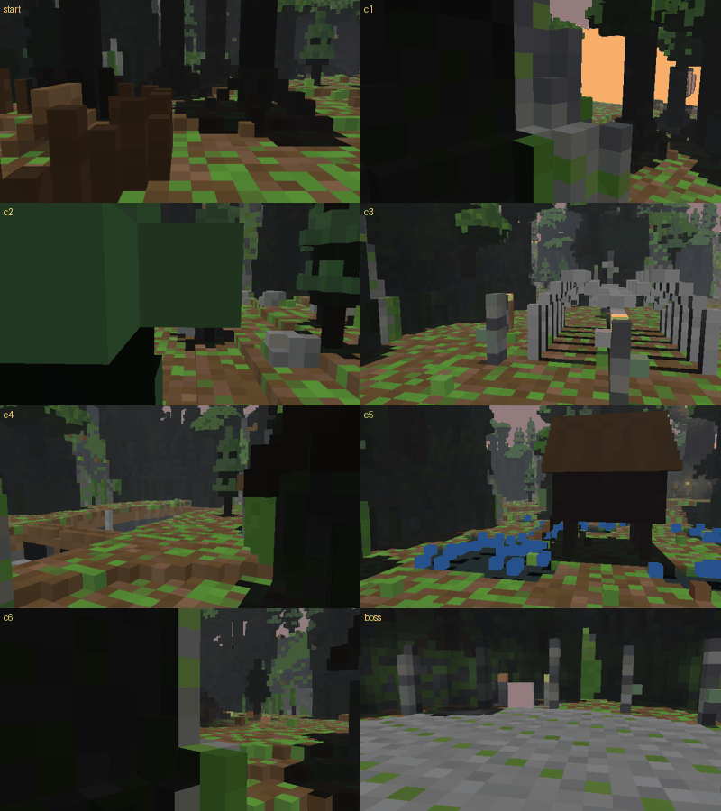 2. 철의 숲 야른비드 |
| 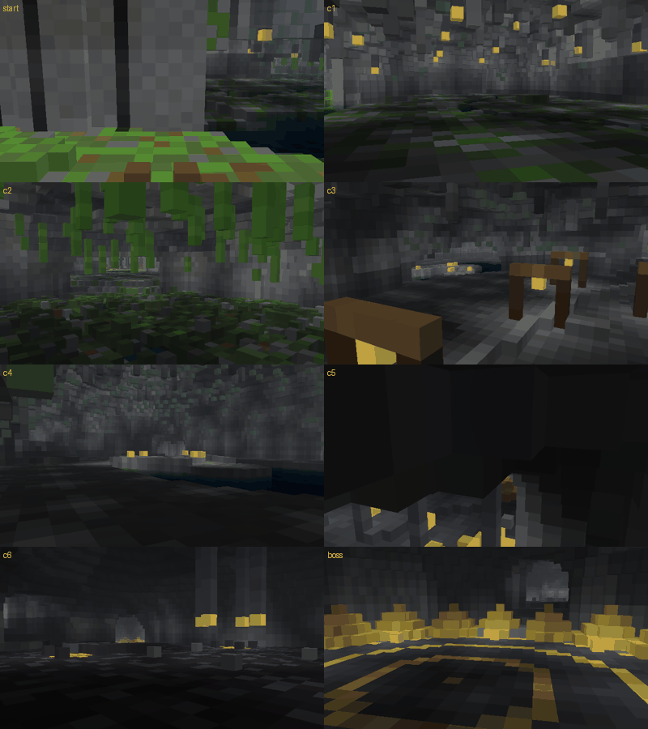 3. 안드바리의 황금 동굴 | 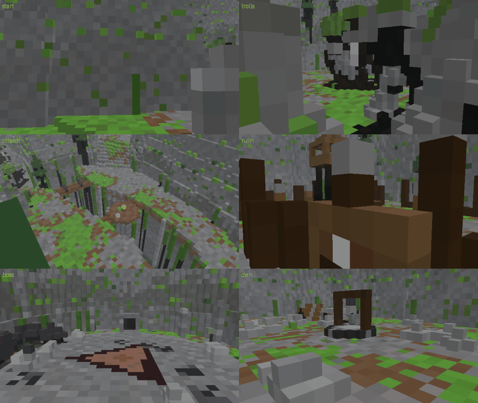 4. 흐룽그니르의 돌산 |
| 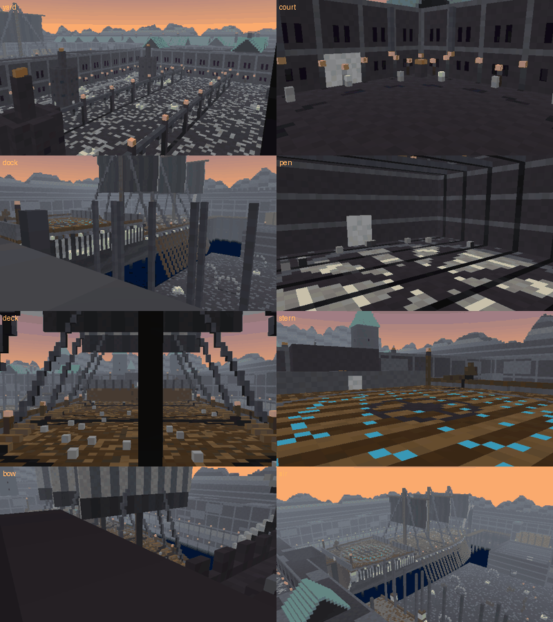 5. 나글파르 조선 요새 | 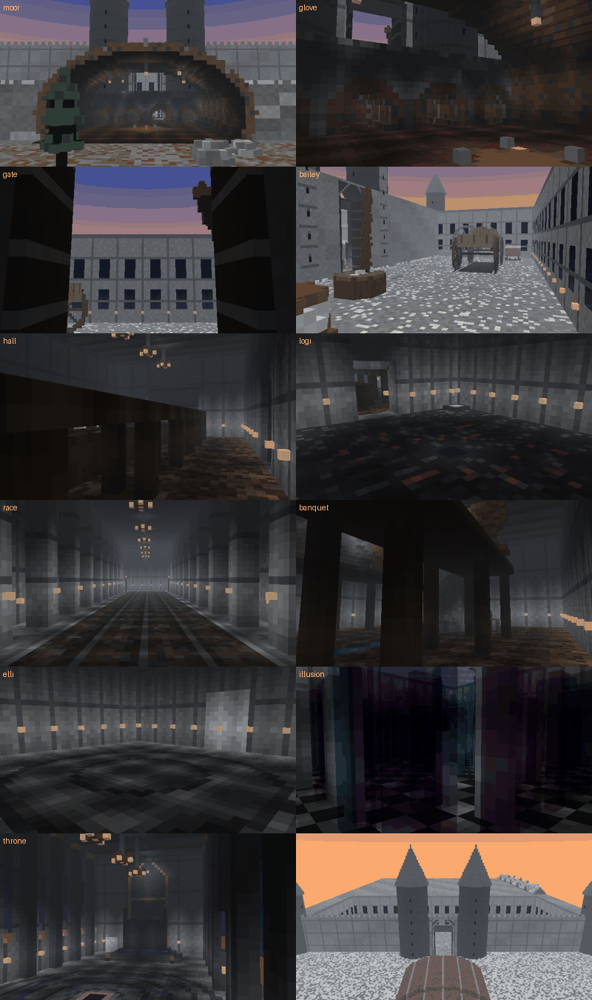 6. 우트가르드 거인 성채 |
| 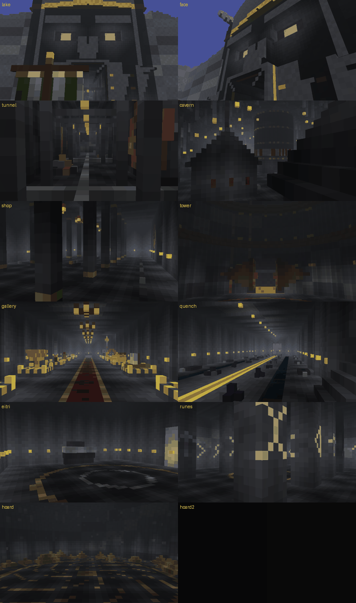 7. 니다벨리르 대장간 성채 | 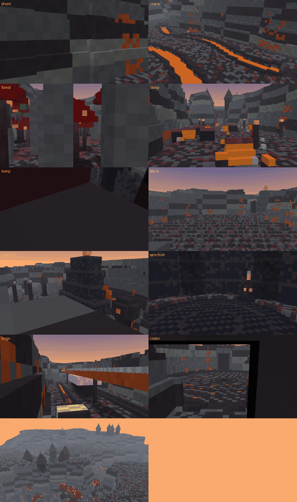 8. 무스펠헤임 불꽃의 문 |
| 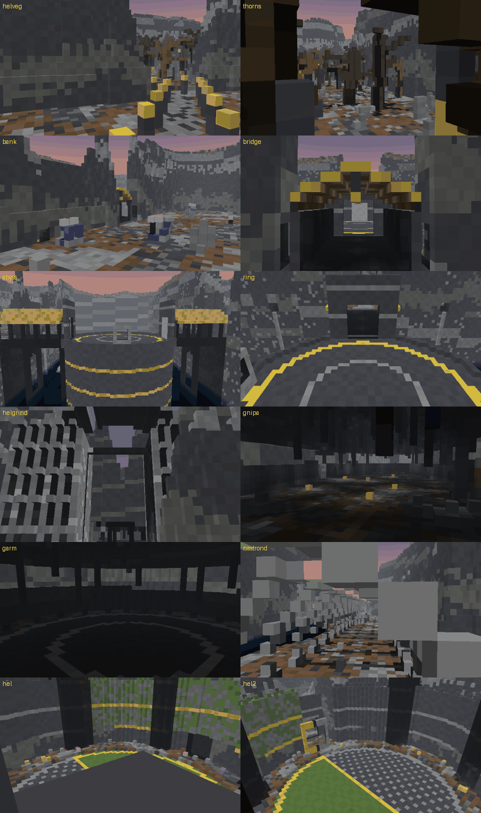 9. 헬헤임 걀라르 다리 | 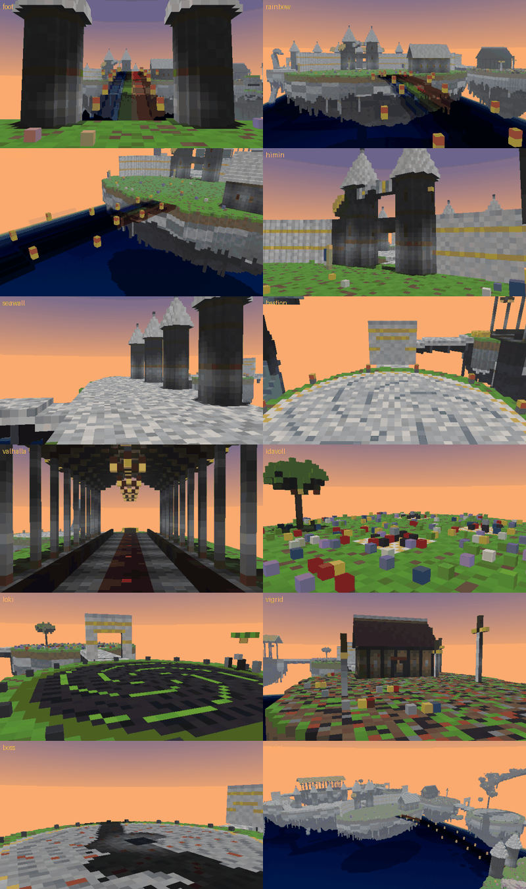 10. 비프로스트와 신들의 황혼 |

## 다시 만들기

```
cd generator
pip install -r requirements.txt
python build_world.py ../build                 # 항구 + 던전 10개 + 팩 전체 (약 10분)
python build_world.py ../build --only d01,d02  # 일부 던전만
python build_world.py ../build --keep ../work  # 만든 지형을 ../work 에 남겨 둠
python build_world.py ../build --repack --keep ../work  # 스크립트·모델만 고쳤을 때: 지형은 그대로, 팩만 다시 묶기(몇 초)
python rp_check.py ../build/packs/norse_rpg_rp # 리소스 팩 참조 검사
```

- 결과: `NorseRPG.mcworld`, `NorseRPG_behavior.mcpack`, `NorseRPG_resources.mcpack`, `world_info.json`, `build_report.json`.
- `previews/spawn_harbour.png`가 출력 폴더에 있으면 월드 아이콘으로 씁니다.
- 던전·보스·기술·몬스터 수치는 `generator/nr_design.py`에서, 강화 확률·일일보상은 `generator/js/rpg.js`에서 고칠 수 있습니다.
- 던전 지형은 `d01_barrow.py` ~ `d10_ragnarok.py`, 항구는 `nr_spawn.py`, 보스 모델은 `nr_models.py`가 만듭니다.
- 빌드할 때마다 걸어 보기 검사(`nr_verify.py`, `trapcheck.py`)가 돌아서 빠지면 못 나오는 구덩이는 자동으로 메우고,
  맵 탈출 경로와 보스 문 우회로를 `build_report.json`에 기록합니다.
