# RPG 모험의 길 — Minecraft Bedrock RPG 서버용 월드

`RPGWorld.mcworld` 하나에 지역 11곳이 **모두 길로 이어진** 베드락 에디션 월드입니다.
스폰(뽑기장)에서 출발해 걸어서 워든 서식지까지 갈 수 있고, 다음 지역은 색 유리창 너머로 미리 보입니다.
지역을 옮길 때 TP가 필요 없습니다.

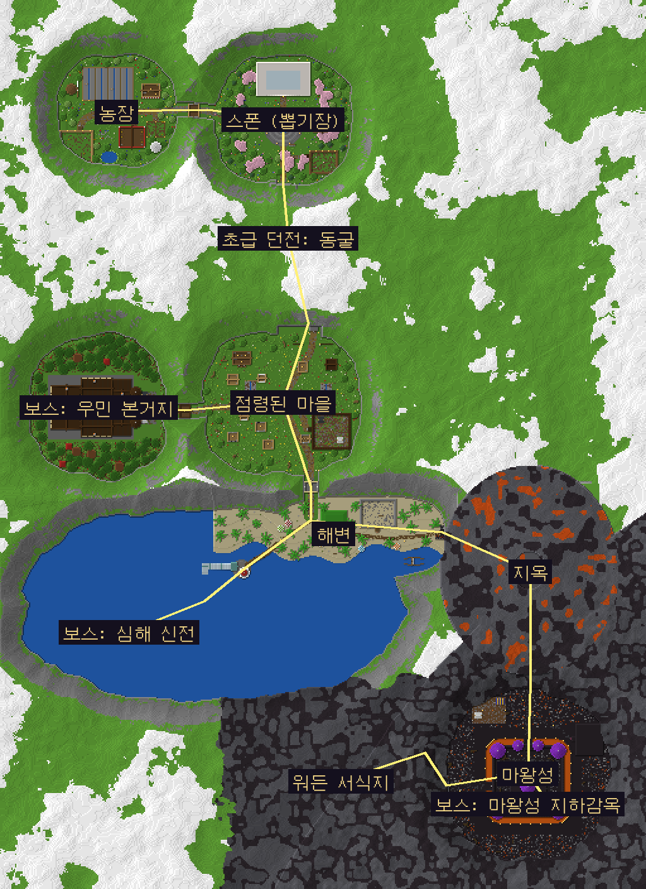

- **설치**: `RPGWorld.mcworld`를 열면 월드 목록에 추가됩니다.
  전용 서버(BDS)에서는 압축을 풀어 `worlds/` 폴더에 넣고 `server.properties`의 `level-name`을 그 폴더 이름으로 바꾸면 됩니다.
- **검증한 버전**: Bedrock Dedicated Server 1.26.52에서 불러와 시험했습니다. 1.21.60 이상이면 열립니다.
- **기본 설정** (`level.dat`과 첫 실행 함수에 들어 있음, 서버에서 바꿔도 됩니다)
  - 모험 모드, 난이도 보통: 몬스터가 사라지지 않게 보통으로 했습니다.
  - 낮밤·날씨 순환 켜짐, 낙하·화염·익사 피해 켜짐, 인벤토리 유지 꺼짐. RPG 서버 기본값에 맞췄습니다.
  - **자연 몹 스폰 꺼짐**: 몬스터는 각 사냥터에서 직접 소환하는 전제입니다.
  - 몹 그리핑 꺼짐(크리퍼·엔더맨이 맵을 부수지 않음), 불 번짐 꺼짐, TNT 폭발 꺼짐.
  - 리스폰 정박기 폭발 꺼짐: 지옥 교역소에 장식 정박기가 있습니다.
  - 치트 켜짐: 행동 팩 함수와 관리자 함수용입니다.

## 지역과 길

```
스폰(뽑기장) ─ 노란 유리 관문 ─ 농장
   └ 주황 유리 회랑 ─ [동굴: 초급 던전] ─ 연두 유리 회랑 ─ 점령된 마을
                                            ├ 초록 유리 관문 ─ [보스] 우민 본거지
                                            └ 하늘색 유리 관문 ─ 해변
                                                 ├ 바다 밑 유리 터널 ─ [보스] 심해 신전
                                                 └ 해변길 ─ 빨간 유리 회랑 ─ 지옥
                                                      └ 보라 유리 관문 ─ 마왕성
                                                           ├ 대전당 계단(빨간 유리 감시 회랑) ─ [보스] 지하감옥
                                                           └ 뒷문 ─ 심연의 계단(청록 유리) ─ 워든 서식지
```

- **색 유리창**: 지역 사이 관문과 회랑의 벽은 색 유리입니다. 걸어가는 동안 다음 지역이 그대로 보입니다.
  관문 건물(농장·우민 본거지·해변·마왕성)은 다음 지역 쪽 벽 전체가 유리창이고,
  동굴·지옥·지하감옥·워든 서식지는 회랑 한쪽 벽이 그 지역 내부를 내려다보는 창입니다.
  심해 신전으로 가는 길은 바닷속을 지나는 유리 터널입니다.
- **지역 사이 거리**: 지역 사이는 관문 회랑과 길로 30~60칸 떨어져 있습니다.
  사냥터는 모두 벽으로 막혀 있고 큰길에서 비켜나 있어서, 몬스터가 다른 지역의 플레이어를 보고 따라오기 어렵습니다.
- **편의 공간**: 지역마다 그 지역 분위기에 맞춘 편의 공간이 하나씩 있습니다. 모두 11곳입니다.
  - 카운터 뒤에 상인(NPC) 자리를 비워 두었습니다. 그 자리 바닥 밑에 자석석(lodestone) 표식이 있습니다.
  - 카운터 손님 쪽에 엔더 상자를 2개씩 놓았습니다.
  - NPC는 넣지 않았으니 서버에서 쓰는 상점 NPC나 애드온을 표의 좌표에 세우면 됩니다.

| 지역 | 분위기 | 편의 공간 | 사냥터 | 보스 |
|---|---|---|---|---|
| 스폰 | 산에 둘러싸인 꽃 계곡. 분수 광장, 석영 뽑기장(기계 4대), 안내판 | 모험가 쉼터(목조 시장 건물) | 초보자 훈련장(허수아비) | |
| 농장 | 산에 둘러싸인 계곡. 밭 4구역, 빨간 헛간, 풍차, 사일로, 동물 우리(소·양·돼지·닭) | 농장 직판장(줄무늬 차양) | 들판 사냥터(통나무 울타리) | |
| 동굴 (초급 던전) | 작은 동굴. 종유석, 광석, 지하 연못, 자수정 굴, 광산 레일 | 광부의 쉼터(통나무 오두막) | 동굴 사냥터(둥근 굴, 천장 있음) | |
| 점령된 마을 | 우민이 차지한 마을. 불탄 집, 감시탑, 바리케이드, 우민 깃발, 갇힌 주민 우리 | 저항군 은신처(여관) | 점령지 광장(가시 목책, 우민 천막) | |
| 우민 본거지 | 어두운 참나무 숲 속 3층 저택. 쌍둥이 탑, 굴뚝, 대계단, 서재, 작전실 | 잠입 거점 | 근위대 훈련장(저택 1층) | 의식의 대전당: 옥좌·의식 원·샹들리에, 17칸 높이, 2층 관람창 |
| 해변 | 야자수, 파라솔, 모래성, 난파선, 등대, 부두, 산호초 | 해변 매점(초가지붕) | 해안 사냥터(사암·유목 울타리) | |
| 심해 신전 | 바다 밑 프리즈머린 신전, 유리 돔 | 잠수부 기지(수조) | 가라앉은 회랑 | 심연의 제단: 가운데 수조(깊이 4, 수중 보스용), 유리 돔, 전달체 제단 |
| 지옥 | 화산 속 큰 동굴. 용암 호수, 요새 다리와 섬 탑, 현무암 삼각주, 뒤틀린 숲, 진홍 숲, 영혼 모래 골짜기, 용암 폭포 | 피글린 교역소(보루 양식) | 요새 사냥터(지붕 있음: 블레이즈도 못 나감) | |
| 마왕성 | 검은 분화구 속 성. 용암 해자, 보라 첨탑 7개, 성문, 안뜰, 마왕의 대전(빈 옥좌) | 용사의 야영지(천막) | 마왕군 연병장(지붕 있음) | |
| 지하감옥 | 성 지하 깊이. 2층 감방, 매달린 우리, 쇠사슬, 영혼 화로 | 간수 초소 | 감방 구역 | 대감옥 심판장: 37×37칸, 높이 22칸 |
| 워든 서식지 | 심층암 동굴 속 고대 도시. 강화 심층암 대문, 폐허, 스컬크(비명 감지체는 워든을 부르지 않게 설정), 촛불, 다음 지역 봉인문(준비 중) | 탐험가 은신처(양털 벽) | 고대 도시 사냥터(지붕 있음) | |

## 미리보기

| | |
|---|---|
| 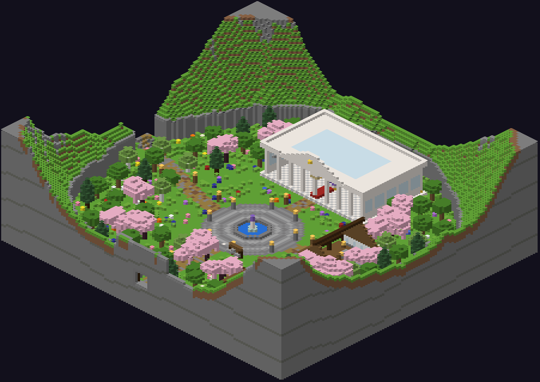 스폰 계곡과 뽑기장 | 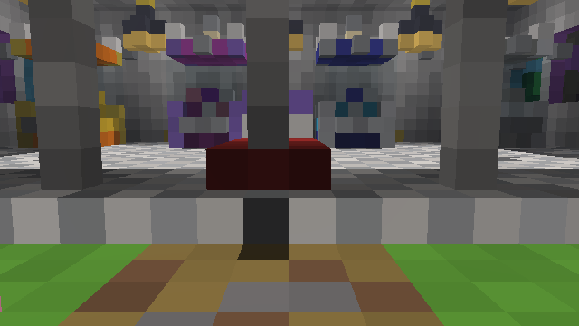 뽑기장 안: 등급별 뽑기 기계 4대 |
| 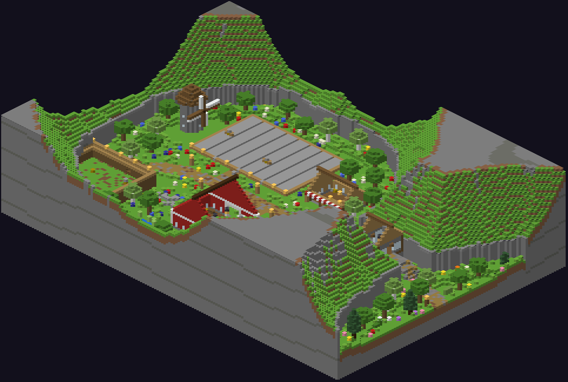 농장 | 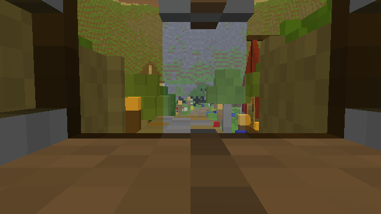 노란 유리 관문 너머로 보이는 농장 |
| 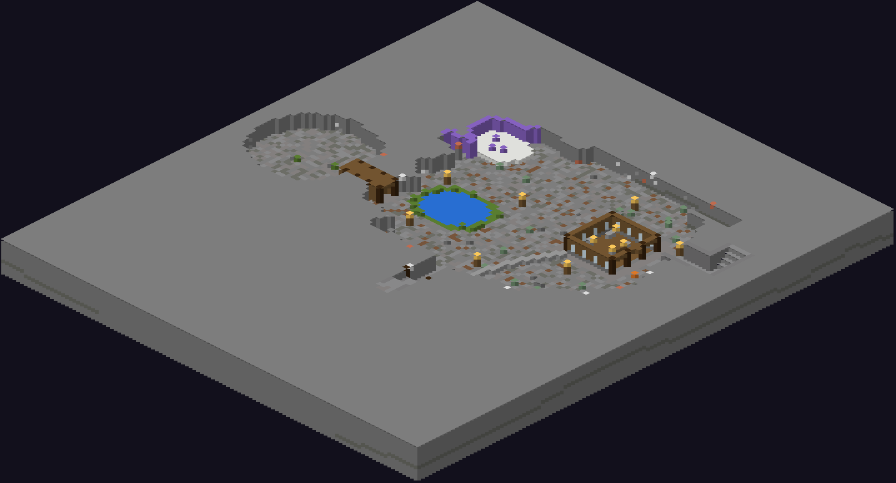 동굴 바닥 단면 | 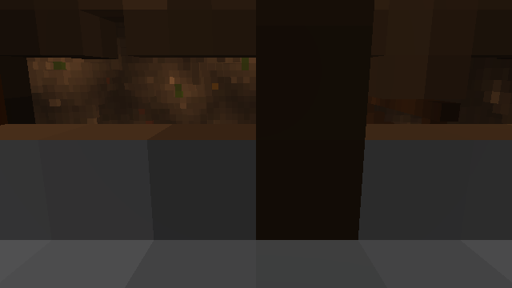 주황 유리창 너머 동굴 |
| 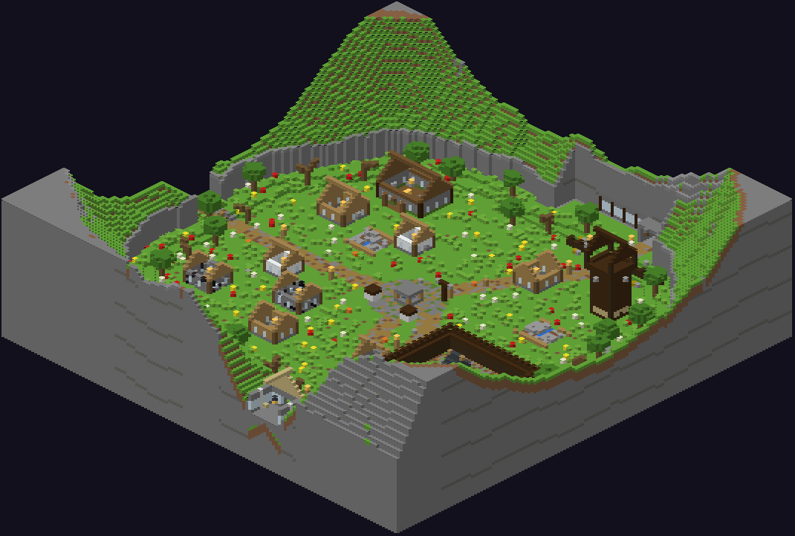 점령된 마을 | 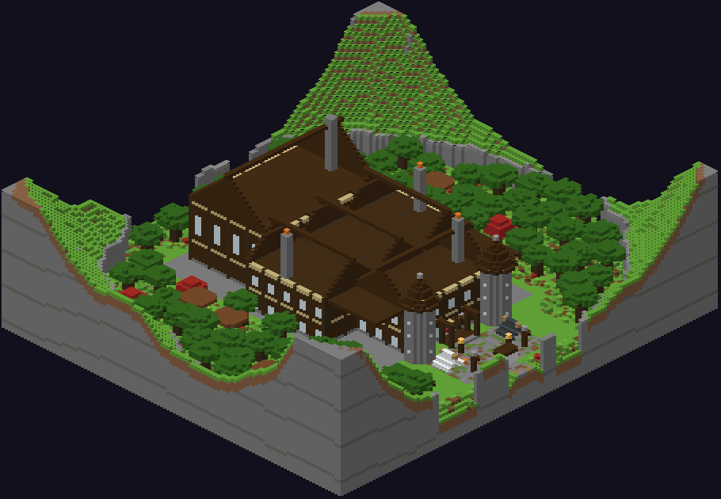 우민 본거지 저택 |
| 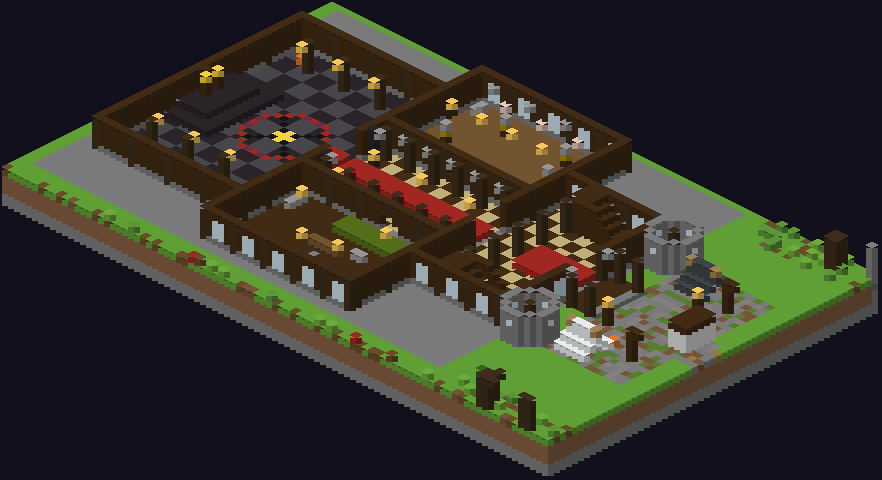 저택 1층: 대전당·훈련장·잠입 거점 | 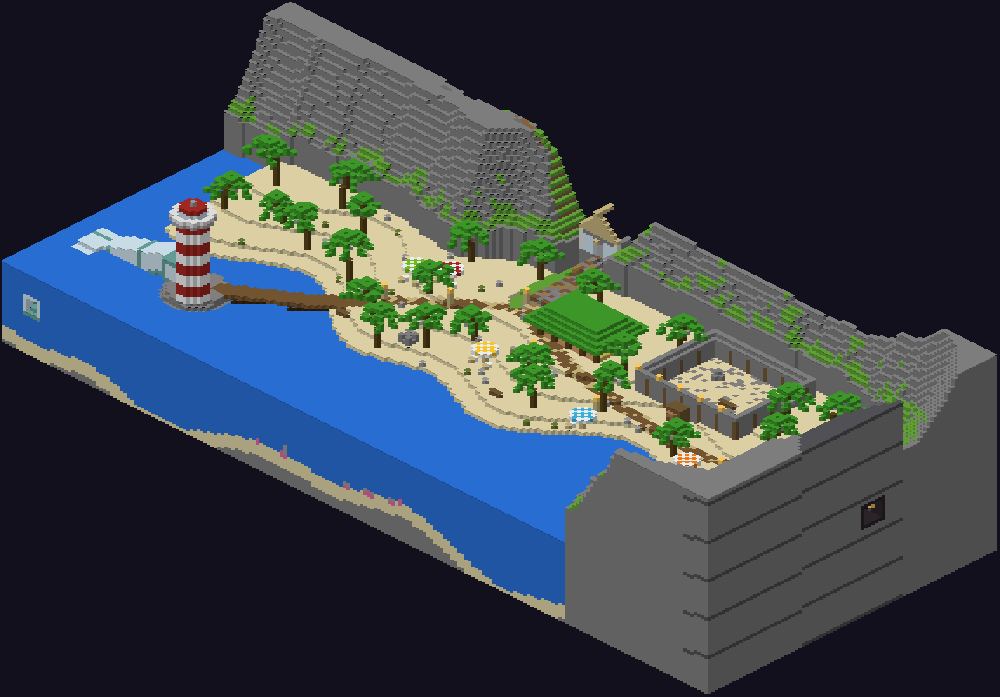 해변과 등대 |
| 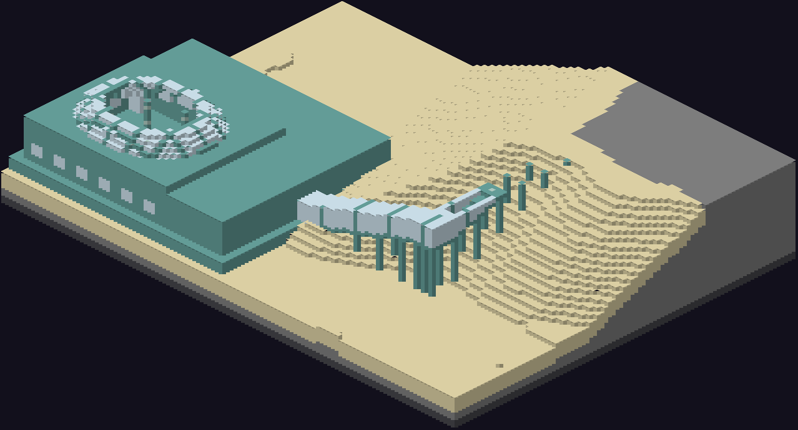 심해 신전과 유리 터널(물을 숨기고 그림) | 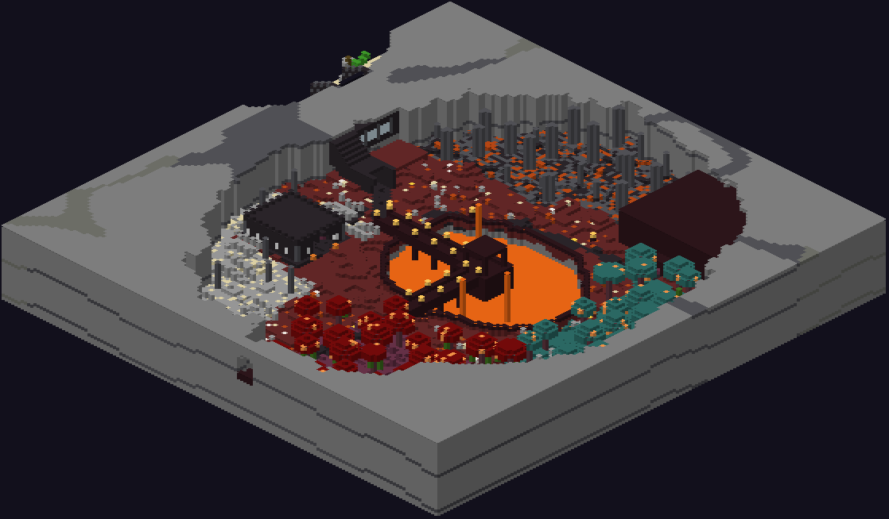 지옥 동굴 |
| 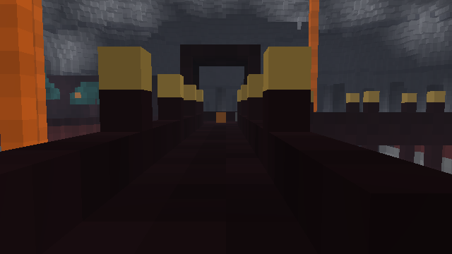 용암 호수 위 요새 다리 | 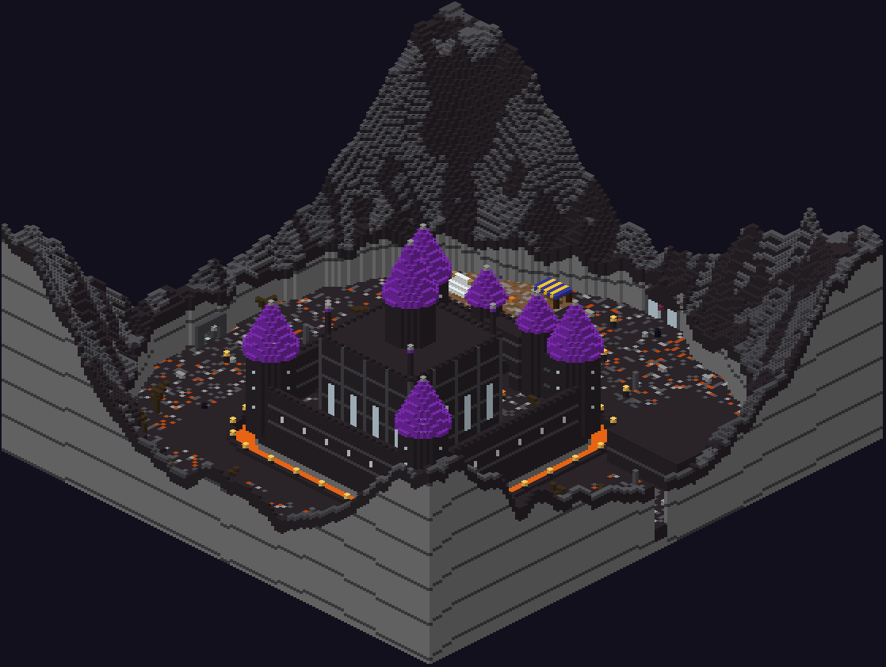 마왕성 |
| 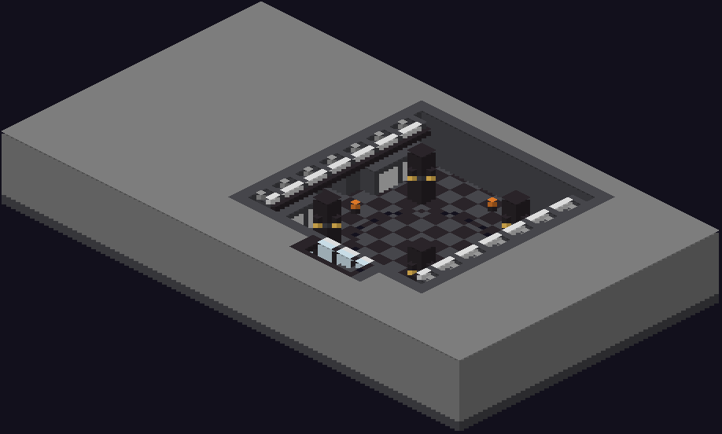 지하감옥 심판장 단면 | 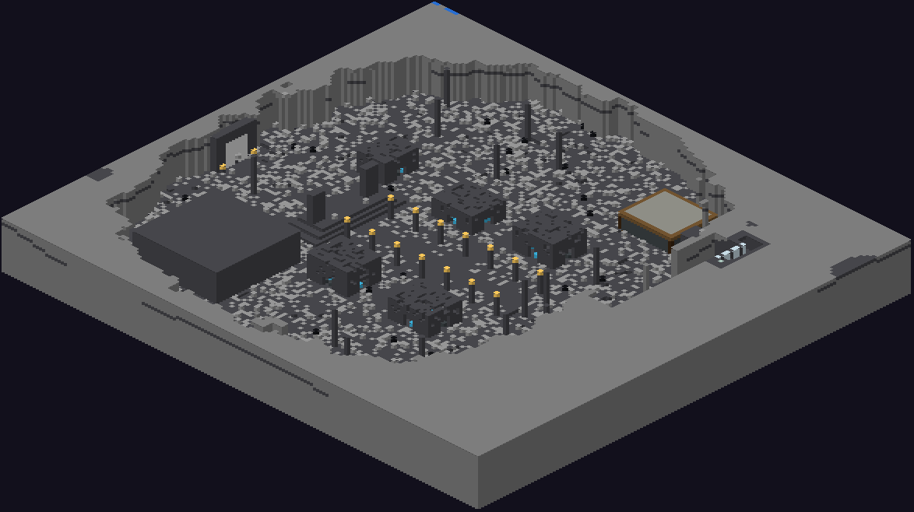 워든 서식지 고대 도시 |

## 사냥터

- 사냥터는 모두 **벽으로 둘러싸여** 있습니다. 출입구는 **울타리 문 2개를 연달아** 둔 통로입니다.
  플레이어는 문을 열 수 있지만 몬스터는 열지 못합니다.
- 천장이 없는 사냥터 4곳(훈련장·들판·점령지 광장·해안)은 벽 맨 위가 안쪽으로 한 칸 튀어나와 거미가 넘지 못합니다.
  날아다니는 몹(블레이즈·벡스·팬텀·가스트)은 천장이 있는 사냥터에 소환하세요.
- 바닥은 평평하고, 스폰 지점(아래 표)은 엄폐물과 겹치지 않게 골랐습니다.
- 사냥터 조명은 보이지 않는 조명 블록(밝기 11)입니다.
  - `/function rpg/arena/<키>_off`로 끄면 밝기 0이 되어 자연 스폰이 가능해집니다. `_on`으로 다시 켭니다.
  - 자연 스폰을 쓰려면 `gamerule domobspawning true`도 필요합니다.
  - 천장이 없는 사냥터는 낮에는 햇빛 때문에 몬스터가 자연 스폰되지 않습니다.
- 사냥터 바깥은 전부 밝기 1 이상으로 맞췄습니다. 그래서 자연 스폰을 켜도 길·마을·편의 공간에는 몬스터가 생기지 않습니다.
  어두운 분위기의 동굴·워든 서식지도 아주 약한 조명(밝기 1~3)만 넣었습니다.
- `/function rpg/hunt/<키>`는 그 사냥터 스폰 지점에 **예시 몬스터**를 한 번 소환합니다.
  실제 소환 시스템을 만들 때 참고하거나 함수 파일을 고쳐 쓰세요.

## 관리자 함수 (치트 필요)

| 함수 | 하는 일 |
|---|---|
| `/function rpg/help` | 함수 목록 보기 |
| `/function rpg/tp/<spawn·farm·cave·village·hq·beach·deepsea·nether·castle·dungeon·deepdark>` | 지역 도착 지점으로 이동(관리용) |
| `/function rpg/hunt/<키>` | 사냥터에 예시 몬스터 소환 |
| `/function rpg/arena/<키>_off`, `_on` | 사냥터 조명 끄기/켜기 |
| `/function rpg/boss/<hq·deepsea·dungeon>` | 보스방에 예시 보스 소환(우민 대장군 / 심해의 수호자 / 마왕의 처형인) |
| `rpg/gacha/<common·rare·epic·legend>` | 뽑기 기계 버튼을 누르면 누른 사람 기준으로 실행됩니다. 지금은 안내 메시지만 나오니 보상 명령을 넣으세요 |

함수 파일 위치: 월드 폴더 `behavior_packs/bp_rpg/functions/rpg/`

- 처음 열 때 `rpg/setup`이 한 번 실행되어 게임 규칙을 맞춥니다.
- 농장 우리 청크가 처음 불러와질 때 `rpg/setup_animals`가 동물 9마리를 한 번 소환합니다. 다시 열어도 중복되지 않습니다.

## 좌표

### 지역 도착 지점

| 지역 | 도착 지점 (x y z) | 관리자 이동 |
|---|---|---|
| 스폰 (뽑기장) | 0 65 16 | `/function rpg/tp/spawn` |
| 농장 | -104 65 -14 | `/function rpg/tp/farm` |
| 초급 던전: 동굴 | 30 53 82 | `/function rpg/tp/cave` |
| 점령된 마을 | 24 67 168 | `/function rpg/tp/village` |
| 보스: 우민 본거지 | -108 66 226 | `/function rpg/tp/hq` |
| 해변 | 22 66 312 | `/function rpg/tp/beach` |
| 보스: 심해 신전 | -100 31 404 | `/function rpg/tp/deepsea` |
| 지옥 | 156 61 344 | `/function rpg/tp/nether` |
| 마왕성 | 196 67 452 | `/function rpg/tp/castle` |
| 보스: 마왕성 지하감옥 | 166 25 522 | `/function rpg/tp/dungeon` |
| 워든 서식지 | 90 34 480 | `/function rpg/tp/deepdark` |

### 편의 공간 (상인 자리 · 엔더 상자)

| 지역 | 이름 | 상인(NPC) 자리 | 엔더 상자 |
|---|---|---|---|
| 스폰 (뽑기장) | 모험가 쉼터 | 32 65 -1 | 29 65 -5 / 29 65 -6 |
| 농장 | 농장 직판장 | -105 65 -26 | -109 65 -23 / -110 65 -23 |
| 초급 던전: 동굴 | 광부의 쉼터 | 19 53 87 | 22 53 91 / 22 53 92 |
| 점령된 마을 | 저항군 은신처 | -33 65 185 | -37 65 188 / -38 65 188 |
| 보스: 우민 본거지 | 잠입 거점 | -148 66 243 | -144 66 240 / -143 66 240 |
| 해변 | 해변 매점 | 40 67 314 | 36 67 317 / 35 67 317 |
| 보스: 심해 신전 | 잠수부 기지 | -104 31 422 | -100 31 419 / -99 31 419 |
| 지옥 | 피글린 교역소 | 156 62 373 | 159 62 377 / 159 62 378 |
| 마왕성 | 용사의 야영지 | 172 67 457 | 168 67 460 / 167 67 460 |
| 보스: 마왕성 지하감옥 | 간수 초소 | 164 25 516 | 167 25 520 / 167 25 521 |
| 워든 서식지 | 탐험가 은신처 | 80 33 477 | 83 33 481 / 83 33 482 |

### 사냥터

| 지역 | 이름 | 내부 범위 (x1 y1 z1 ~ x2 y2 z2) | 지붕 | 입구 | 스폰 지점 | 함수 키 |
|---|---|---|---|---|---|---|
| 스폰 (뽑기장) | 초보자 훈련장 | 22 65 24 ~ 42 69 40 | 없음 (위가 열림) | 17 65 28 | 27 65 30 / 32 65 30 / 37 65 30 / 27 65 34 / 32 65 34 / 37 65 34 | `spawn_training` |
| 농장 | 들판 사냥터 | -176 65 8 ~ -152 69 32 | 없음 (위가 열림) | -162 65 3 | -168 65 14 / -160 65 14 / -168 65 20 / -160 65 20 / -168 65 26 / -160 65 26 | `farm_field` |
| 초급 던전: 동굴 | 동굴 사냥터 | -56 53 92 ~ -32 62 116 | 있음 | -23 53 104 | -50 53 99 / -44 53 98 / -38 53 100 / -50 53 108 / -43 53 110 / -38 53 107 / -44 53 104 | `cave` |
| 점령된 마을 | 점령지 광장 | 24 65 232 ~ 52 70 258 | 없음 (위가 열림) | 19 65 244 | 33 65 238 / 38 65 238 / 45 65 238 / 31 65 245 / 38 65 245 / 45 65 245 / 31 65 252 | `village_square` |
| 보스: 우민 본거지 | 근위대 훈련장 | -159 66 204 ~ -137 71 218 | 있음 | -149 66 220 | -154 66 210 / -148 66 209 / -143 66 210 / -154 66 215 / -142 66 215 / -148 66 212 | `hq_barracks` |
| 해변 | 해안 사냥터 | 62 65 300 ~ 88 70 320 | 없음 (위가 열림) | 75 65 325 | 69 65 306 / 75 65 306 / 82 65 306 / 68 65 314 / 75 65 314 / 82 65 314 | `beach_cove` |
| 보스: 심해 신전 | 가라앉은 회랑 | -147 31 383 ~ -97 37 394 | 있음 | -105 31 397 | -139 31 388 / -139 31 389 / -127 31 388 / -127 31 389 / -113 31 388 / -113 31 389 / -103 31 388 / -103 31 389 | `deepsea_gallery` |
| 지옥 | 요새 사냥터 | 212 61 300 ~ 240 70 322 | 있음 | 225 61 327 | 219 61 304 / 219 61 318 / 227 61 304 / 227 61 318 / 235 61 304 / 235 61 318 | `nether_fortress` |
| 마왕성 | 마왕군 연병장 | 233 67 478 ~ 252 75 500 | 있음 | 228 67 489 | 239 67 484 / 246 67 484 / 239 67 489 / 246 67 489 / 239 67 494 / 246 67 494 | `castle_drill` |
| 보스: 마왕성 지하감옥 | 감방 구역 | 140 25 504 ~ 159 32 532 | 있음 | 162 25 519 | 143 25 510 / 143 25 526 / 149 25 510 / 149 25 526 / 156 25 510 / 156 25 526 | `dungeon_cells` |
| 워든 서식지 | 고대 도시 사냥터 | 8 33 548 ~ 32 41 572 | 있음 | 20 33 543 | 16 33 553 / 16 33 560 / 16 33 568 / 24 33 553 / 24 33 560 / 24 33 568 | `deepdark_plaza` |

### 보스방

| 지역 | 보스방 | 보스 소환 지점 | 입구 | 예시 보스 함수 |
|---|---|---|---|---|
| 보스: 우민 본거지 | 의식의 대전당 | -170 66 226 | -159 66 226 | `/function rpg/boss/hq` |
| 보스: 심해 신전 | 심연의 제단 | -132 29 412 | -110 31 404 | `/function rpg/boss/deepsea` |
| 보스: 마왕성 지하감옥 | 대감옥 심판장 | 194 25 518 | 176 25 518 | `/function rpg/boss/dungeon` |

### 뽑기 기계

| 등급 | 버튼 위치 | 버튼을 누르면 실행되는 함수 |
|---|---|---|
| common | -15 67 -37 | `rpg/gacha/common` |
| rare | -5 67 -37 | `rpg/gacha/rare` |
| epic | 5 67 -37 | `rpg/gacha/epic` |
| legend | 15 67 -37 | `rpg/gacha/legend` |

### 관문 · 유리창 회랑

| 연결 | 위치 | 유리 색 |
|---|---|---|
| 스폰 (뽑기장) → 농장 | -71 70 -9 | yellow (관문 건물) |
| 점령된 마을 → 보스: 우민 본거지 | -78 70 229 | green (관문 건물) |
| 점령된 마을 → 해변 | 22 71 289 | light_blue (관문 건물) |
| 지옥 → 마왕성 | 196 67 444 | purple (관문 건물) |
| 스폰 → 동굴 (입구 아치 + 동굴을 내려다보는 회랑) | 입구 0 65 49, 회랑 z=63 (x 0~43) | orange |
| 동굴 → 점령된 마을 (마을 쪽 절벽 회랑) | 회랑 z=158 (x 4~26), 출구 24 67 165 | lime |
| 해변 → 심해 신전 (바다 밑 유리 터널) | 등대 섬 입구 -40 65 352 → 신전 -96 31 404 | 투명 + light_blue 띠 |
| 해변 → 지옥 (폐허 차원문 + 동굴 벽 회랑) | 차원문 128 66 325, 회랑 x=141 (z 326~346) | red |
| 마왕성 대전당 → 지하감옥 (계단 + 감시 회랑) | 계단 입구 199 71 524, 회랑 z=540 | red + 철창 |
| 마왕성 뒷문 → 워든 서식지 (심연의 계단) | 입구 130 67 526, 회랑 x=113 (z 480~526) | cyan |

## 검증

게임 클라이언트 없이 아래 방법으로 확인했습니다.

| 검사 | 결과 |
|---|---|
| 스폰에서 출발한 이동 시뮬레이션(모험 모드, 점프 1칸, 수영, 사다리, 울타리 문은 열린 것으로 계산) | 걸어서 갈 수 있는 위치 약 106만 곳(대부분 바닷물 속) |
| 들어가면 못 나오는 곳 | **0** |
| 정해진 구역 밖(산 위, 건물 지붕 등)으로 나가는 곳 | **0** |
| 걸어서 떨어지면 4칸 이상 낙하하는 곳(낙하 피해가 켜져 있어서 확인) | **0** |
| 지역 도착 지점·편의 공간 11곳·엔더 상자 22개·사냥터 11곳·보스방 3곳에 걸어서 도달 | 모두 도달 |
| 물·용암이 새는 곳(바다 밑 터널, 심해 신전, 용암 호수, 해자) | **0** |
| 사냥터 밖 밝기 | 모든 지점 1 이상(자연 스폰 없음). 동굴 2 이상, 우민 저택 6 이상, 심해 신전 6 이상, 지하감옥 4 이상, 워든 서식지 중간값 3 |
| 전용 서버(BDS 1.26.52) | 행동 팩 로드, 스크립트 실행(뽑기 버튼 4개 인식), 첫 실행 설정, 농장 동물 9마리 소환, 사냥터 조명 끄기/켜기, 예시 몬스터·보스 소환, 엔더 상자·뽑기 버튼 블록 확인. 1분 넘게 돌린 뒤 저장된 블록 비교: 물·용암 흐름 0, 떨어진 블록 0. 남은 차이는 형식 갱신(계단 모서리, 판유리·울타리 연결)과 무작위 틱(블록 아래 덮인 잔디가 흙으로 바뀜, 밀·자수정 성장)뿐 |

## 직접 확인이 필요한 것

- **클라이언트 상호작용**: 전용 서버에는 플레이어가 없어서 시험하지 못했습니다.
  뽑기 버튼 누르기, 울타리 문 열기, 엔더 상자 열기, 실제 화면 모습은 게임에서 한 번 확인해 주세요.
  - 뽑기 스크립트가 실행되는 것과 버튼 블록이 그 자리에 있는 것은 서버에서 확인했습니다.
- **몬스터 행동**: 사냥터 안에서 몬스터가 어떻게 움직이는지는 시험하지 않았습니다.
  예시 소환 함수로 몬스터가 생기는 것까지만 확인했습니다.
  - 벡스처럼 벽을 통과하는 몹은 사냥터 벽으로 막을 수 없습니다.
- **생물군계 분위기**: 지옥은 지옥 생물군계, 마왕성은 현무암 삼각주, 워든 서식지는 딥 다크로 지정했습니다.
  안개나 입자 같은 실제 화면 분위기는 클라이언트에서 확인이 필요합니다.
- 미리보기 그림(`previews/`)은 직접 만든 렌더러로 그린 근사치입니다.
  유리는 색만 입혀 투명하게 그리고, 꽃이나 작물은 큰 블록처럼 보입니다.

## 다시 만들기

```bash
cd generator
pip install -r requirements.txt
python build.py ..        # 약 6분: 생성 → 검사 → 조명 → 행동 팩 → .mcworld → 미리보기
python readme_tables.py   # README 좌표표 다시 출력
```

지역마다 `area_*.py` 파일 하나이고, 위치는 `layout.py`에 모여 있습니다.
공용 부품(사냥터, 편의 공간, 관문, 유리 터널)은 `rpg_parts.py`에 있습니다.
