# 스카이젠 — 하늘섬 군도 (Minecraft Bedrock 스카이젠 서버용 월드)

`SkyGen.mcworld` 하나에 하늘에 떠 있는 섬 6개가 다리로 이어진 베드락 에디션 스카이젠 월드입니다.
섬들은 능력 술래잡기 맵(숲·화산·낙원·우주선·도서관, 공장 제외)과 로비를 스카이젠에 맞게 다시 만든 것입니다.
행동 팩 스크립트가 들어 있어서 따로 애드온을 설치할 필요가 없습니다.

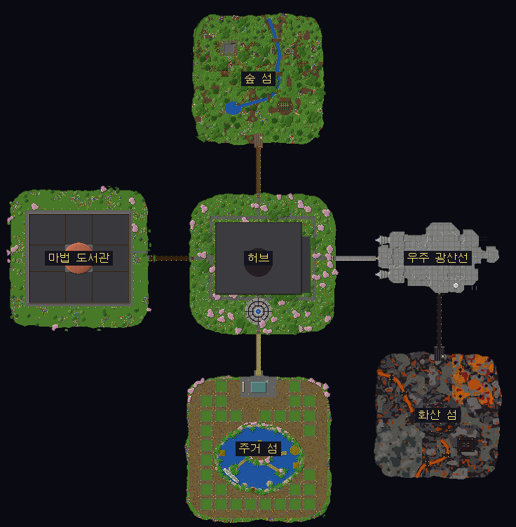

- **설치**: `SkyGen.mcworld`를 열면 월드 목록에 추가됩니다.
  전용 서버(BDS)에서는 압축을 풀어 `worlds/` 폴더에 넣고, `server.properties`의 `level-name`을 그 폴더 이름으로 바꾸세요.
- **필요 버전**: 1.21.90 이상. 스크립트는 `@minecraft/server` 2.0.0과 `@minecraft/server-ui` 2.0.0을 씁니다.
  Bedrock Dedicated Server 1.26.52에서 불러와 시험했습니다.
- **크기**: 736 × 752칸 범위에 섬 6개가 있습니다.
  섬은 지름 약 170~210칸이고, 섬 중심 사이는 224~272칸입니다. 섬 사이 다리는 길이 55~80칸입니다.

## 공통 규칙

| | 낮 (게임 시각 05:00~19:00, 틱 23000~12999) | 밤 (19:00~05:00, 틱 13000~22999) |
|---|---|---|
| PvP | **불가** (모든 곳) | **가능** (안전구역 밖) |
| 인벤토리 세이브 | **켜짐** (죽어도 아이템 유지) | **꺼짐** (죽으면 아이템을 떨어뜨림) |
| 안전구역 | PvP 불가 | **밤에도 PvP 불가** |

- 낮과 밤이 바뀌는 순간 `pvp`·`keepinventory` 게임 규칙이 자동으로 바뀝니다.
  화면 가운데에 "밤이 되었습니다" 또는 "아침이 밝았습니다" 제목이 뜨고, 채팅에도 안내가 나옵니다.
- **안전구역**은 허브 섬, 주거 섬, 마법 도서관 섬 전체입니다.
  상점·집터 사무소·인첸트장이 모두 이 안에 있습니다.
  공격하는 사람이나 맞는 사람 중 한 명이라도 안전구역에 있으면 공격이 막힙니다.
- **PvP 구역**은 광물 섬 3곳(숲 섬, 우주 광산선, 화산 섬)과 그 사이 다리입니다. 개인 화로방도 우주 광산선 안에 있어서 PvP 구역입니다.
- 모험 모드입니다. 블록은 **생성기**와 **내 집터 안**에서만 부수고 놓을 수 있습니다.
- 사용 금지 아이템: 엔더 진주, 후렴과, 돌풍구. 순간이동으로 집터 벽을 넘거나 도망치는 것을 막기 위해서입니다.
- 폭발은 모두 막혀 있습니다(TNT, 크리퍼 등). 몹은 자연 스폰되지 않습니다.
- 밤에 다른 플레이어와 싸우면 10초 동안 **전투 중** 상태가 됩니다. 전투 중에는 포털과 메뉴 이동을 쓸 수 없습니다.
- 처음 들어오면 기본 지급품을 받습니다: 나무 곡괭이·도끼·검, 빵 8개, 100원.
- 핫바 9번 칸에 **스카이젠 메뉴**(나침반)가 생깁니다. 이 나침반은 버릴 수 없고, 죽어도 사라지지 않습니다.
- 돈은 오른쪽 사이드바에 표시됩니다(`money` 점수판).

## 섬 구성

```
                     숲 섬 (나무 · 돌)
                        │
마법 도서관 ── 허브 (스폰 · 상점) ── 우주 광산선 (석탄 · 철 · 화로방)
 (인첸트)               │                 │
                     주거 섬            화산 섬
                   (집터 31곳)        (금 · 다이아)
```

| 섬 | 원래 맵 | 구역 | 하는 일 |
|---|---|---|---|
| **허브** | 로비 | 안전 | 스폰 지점, 상점 8곳, 안내원, 포털 갤러리, 엔더 상자 4개, 분수 광장. 동서남북 다리 4개가 시작됩니다. |
| **숲 섬** | 숲 | PvP | 벌목장: 원목 기둥 16개, 기둥마다 원목 3칸, 나무 4종류. 채석장: 3칸 깊이 구덩이의 벽이 돌 생성기입니다. |
| **우주 광산선** | 더 스켈드 | PvP | 원자로: 철광석 코어 3×3×3과 벽 광맥. 엔진실: 석탄 광맥. 창고 구역: 개인 화로방 12개. |
| **화산 섬** | 화산 | PvP | 분화구 계단식 단에 다이아몬드 광석. 용암 동굴 벽과 신전에 금광석. 우주 광산선 남쪽 해치에서 다리로 이어집니다. |
| **주거 섬** | 낙원 | 안전 | 석호를 둘러싼 집터 31곳, 집터 사무소(관리인 NPC, 집터 현황판, 엔더 상자 2개). |
| **마법 도서관** | 도서관 | 안전 | 인첸트 테이블 5개(테이블마다 책장 28개), 수리 코너(모루 4·숫돌 2·대장장이 작업대 1), 마법 상인. |

섬 둘레의 낭떠러지와 높은 장식 일부는 PvP와 채광을 하기 좋게 지웠습니다.
섬 밑면은 원뿔 모양 바위로 만들고 매달린 뿌리, 동굴 덩굴, 발광 이끼로 꾸몄습니다.

### 생성기

생성기 블록을 캐면 잠시 **기반암**으로 바뀌었다가 시간이 지나면 다시 원래 광물로 돌아옵니다.
기반암일 때는 부술 수 없습니다.

| 광물 | 섬 | 개수 | 다시 생기는 시간 |
|---|---|---|---|
| 나무 (참나무·자작나무·가문비나무·짙은 참나무 원목) | 숲 섬 벌목장 | 48 | 6초 |
| 돌 | 숲 섬 채석장 | 62 | 4초 |
| 석탄 | 우주 광산선 엔진실 | 36 | 8초 |
| 철 | 우주 광산선 원자로 | 69 | 12초 |
| 금 | 화산 섬 용암 동굴·신전 | 38 | 16초 |
| 다이아몬드 | 화산 섬 분화구 | 36 | 25초 |

- 생성기는 모두 289개입니다. 걸어서 손이 닿는 위치(눈에서 4.5칸 이내)에 있는지 하나씩 확인했습니다.
- 생성기 밑에는 `allow` 블록이 숨어 있어서 모험 모드에서도 캘 수 있습니다.
- 비싼 광물일수록 위험한 곳에 있습니다. 다이아몬드와 금은 허브에서 가장 먼 화산 섬에 있어서, 밤에 들고 돌아오는 길이 PvP 구역입니다.

## 상점

허브 상점 거리의 상인(NPC)을 누르면 상점 화면이 열립니다. 버튼을 한 번 누를 때마다 한 묶음씩 삽니다.

| 상인 | 파는 것 |
|---|---|
| 광물 판매소 | 광물을 팝니다 (아래 표) |
| 도구 상점 | 곡괭이·도끼·삽·괭이 (나무~다이아몬드) |
| 무기 · 갑옷 | 검, 활, 화살, 방패, 가죽·철·다이아몬드 갑옷 |
| 음식 상점 | 빵, 구운 감자, 스테이크, 구운 닭고기, 호박 파이, 황금 당근, 황금 사과 |
| 건축 블록 | 판자, 석재 벽돌, 매끄러운 돌, 벽돌, 사암, 유리, 계단, 울타리, 문, 사다리 등 |
| 장식 블록 | 양털, 카펫, 테라코타, 콘크리트, 화분, 꽃, 랜턴, 그림, 책장 |
| 생활 용품 | 제작대, 화로, 상자, 통, 침대, 횃불, 훈연기, 용광로, 엔더 상자, 씨앗, 묘목, 뼛가루 |
| 인첸트 재료 (허브) · 마법 상인 (도서관) | 청금석, 경험치 병, 책, 책장, 마법 부여대, 모루, 숫돌 |

**판매 가격** (원). 구우면 값이 오릅니다. 상점에서 사는 물건은 되팔 수 없습니다.

| 원목 | 조약돌 | 돌 (구운 것) | 숯 | 석탄 | 철 원석 | 철 주괴 | 금 원석 | 금 주괴 | 다이아몬드 |
|---|---|---|---|---|---|---|---|---|---|
| 2 | 1 | 2 | 3 | 4 | 6 | 10 | 12 | 20 | 50 |

광물 판매는 광물 판매소 NPC나 메뉴의 "광물 판매"로 할 수 있습니다. 메뉴로 팔 때는 안전구역 안에 있어야 합니다.

## 집터

주거 섬에 집터가 31곳 있습니다. 석호가 보이는 앞줄 16곳은 **4,000원**, 나머지 15곳은 **2,500원**입니다.

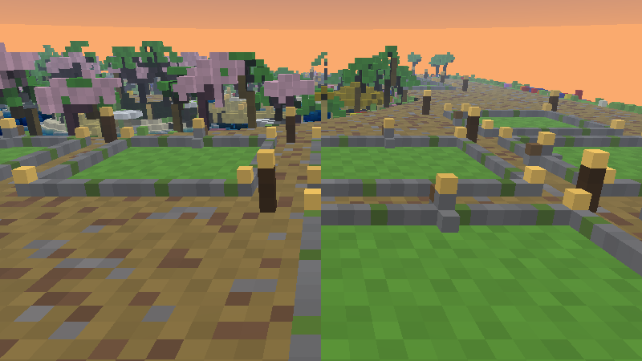

- **크기**: 17×17칸 테두리 안의 15×15칸입니다. 바닥에서 위로 24칸까지 지을 수 있고, 아래로 3칸까지 팔 수 있습니다.
- **허용 블록**: 집터 안쪽 바닥 4칸 아래에 `allow` 블록이 깔려 있어서, 모험 모드에서도 집터 안에서는 블록을 놓고 부술 수 있습니다.
  스크립트도 집터 주인만 그 집터 안에서 블록을 놓고 부수고 상자를 열 수 있게 확인합니다.
- **보더 블록**: 테두리 밑에는 `border_block`이 둘러져 있고, 그 위로 석재 벽돌 테두리와 담장이 있습니다.
- **사기**: 집터 사무소의 **집터 관리인**에게 사거나, 집터 앞 기둥의 **바깥 버튼**을 누르면 구매 화면이 열립니다.
  한 사람이 집터 하나만 가질 수 있습니다. 사무소의 현황판에는 빈 집터가 연두색, 팔린 집터가 빨간색으로 표시됩니다.
- **들어가기·나가기**: 집터에는 문이 없습니다.
  주인이 바깥 버튼을 누르면 안으로, 안쪽 버튼을 누르면 밖으로 순간이동합니다.
  허브 갤러리의 "집" 포털이나 메뉴의 "내 집터로 이동"으로도 갈 수 있습니다.
  출입 지점에 블록을 쌓아 두면 그 위의 빈 자리로 들어갑니다. 출입 버튼은 주인도 부술 수 없습니다.
- **포기**: 집터 관리인에게서 포기하면 값의 절반을 돌려받습니다. 집터 안의 블록과 상자 속 물건은 모두 지워지고, 처음 상태(잔디밭)로 돌아갑니다.

### 핵 사용 자동 영구밴

주인이 아닌 사람이 남의 집터 안에서 0.5초 간격으로 **두 번 연속** 발견되면 자동으로 영구밴됩니다.
감지 범위는 테두리 안쪽 전체 기둥(바닥 6칸 아래부터 높이 320까지)이라서, 벽을 뚫거나 날아서 들어가도 걸립니다.
정상적으로는 버튼으로만 드나들 수 있어서 남의 집터에 들어갈 방법이 없으므로, 안에 있으면 치트(벽 통과·비행·순간이동)로 봅니다.

1. 서버 전체 채팅에 **`[보안] <이름> 플레이어가 핵을 사용하여 영구밴 됬습니다`** 가 뜹니다.
2. 바로 서버에서 추방됩니다. 밴 목록은 월드에 저장되어 다시 접속해도 바로 추방됩니다.
3. 혼자 하는 월드의 호스트는 추방할 수 없어서 허브로 보냅니다.

억울한 밴을 막는 장치:
- 접속하거나 리스폰한 직후 5초는 검사하지 않습니다.
- 접속했을 때 남의 집터 안에 있으면(예: 그동안 주인이 집터를 포기해 다른 사람이 산 경우) 밴하지 않고 집터 밖으로 보냅니다.
- 집터를 포기하거나 관리자가 회수하면 그 안에 있던 사람을 먼저 밖으로 보냅니다.
- 관리자(`sky_admin` 태그, 크리에이티브, 관전자)는 검사하지 않습니다.

## 개인 화로방

우주 광산선 창고 구역에 화로방 12개가 있습니다. 방마다 화로 3개와 용광로 1개가 있습니다.

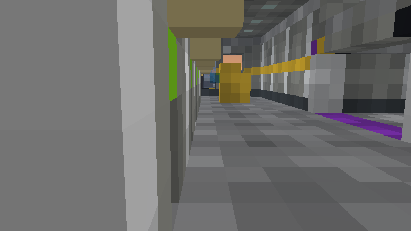

- 문 위의 램프가 **연두색**이면 빈 방, **빨간색**이면 사용 중입니다.
- 누군가 방 안에 있으면 다른 사람은 들어갈 수 없습니다. 들어가려 하면 문 앞으로 밀려나고 "다른 사람이 사용 중인 화로방입니다"가 뜹니다.
- **완전한 안전구역은 아닙니다.** 빈 방에 두 사람이 같은 순간에 들어가면 둘 다 들어가지고, 밤에는 안에서 싸울 수 있습니다.
- 화로방 밖에 있는 화로·용광로(장식용)는 열 수 없습니다.

## 인첸트장

마법 도서관이 인첸트장입니다. 섬 전체가 안전구역입니다.

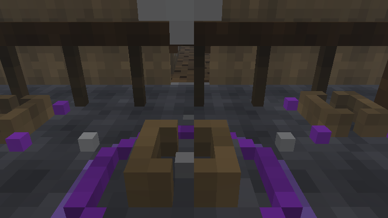

- 인첸트 테이블 5개가 있고, 테이블마다 책장 28개로 둘러싸여 있습니다(최고 레벨 인첸트 가능).
- 수리 코너에서 모루, 숫돌, 대장장이 작업대를 쓸 수 있습니다.
- 마법 상인에게서 청금석과 경험치 병을 살 수 있습니다.

## 이동

- **다리**: 허브에서 숲 섬·우주 광산선·마법 도서관·주거 섬으로 다리가 이어지고, 우주 광산선에서 화산 섬으로 다리가 하나 더 있습니다.
  다리는 폭 5칸 아치형이고, 밑에 사슬과 랜턴이 달려 있습니다.
- **포털 갤러리** (허브 동쪽): 각 섬 모형이 보이는 색유리 관문 6개가 있습니다(숲, 화산, 주거, 집, 우주선, 도서관). 빛나는 바닥에 1초쯤 서 있으면 이동합니다.
- **귀환 발판**: 허브를 뺀 섬 5곳의 도착 지점 옆에 있습니다. 1초쯤 서 있으면 허브로 돌아갑니다.
- **메뉴 → 허브로 이동**: 낮이나 안전구역에서는 바로 이동합니다. 밤에 PvP 구역에서는 5초 동안 가만히 있어야 하고, 움직이면 취소됩니다.

메뉴(나침반)에서 할 수 있는 것: 허브로 이동, 내 집터로 이동 또는 집에서 나가기, 내 정보, 규칙/도움말, 광물 판매.

## 관리자

관리자는 서버에서 먼저 아래 함수를 실행하세요. 관리자가 아닌 상태로 남의 집터에 들어가면 관리자도 밴됩니다.

| 명령 | 하는 일 |
|---|---|
| `/function sky/admin_on` | 관리자 모드(태그 `sky_admin` + 크리에이티브). 보호와 밴 검사에서 빠집니다. |
| `/function sky/admin_off` | 관리자 모드 해제(모험 모드로) |
| `/function sky/day` · `/function sky/night` | 낮(1000) · 밤(14000)으로 바꾸기 |
| `/function sky/tp/hub` (forest · skeld · volcano · paradise · library) | 섬 도착 지점으로 이동 |
| `/function sky/help` | 이 목록 보기 |
| `/scriptevent sky:unban 이름` | 밴 해제 |
| `/scriptevent sky:bans` | 밴 목록 보기 |
| `/scriptevent sky:money 이름 금액` | 돈 지급 (음수면 차감) |
| `/scriptevent sky:plotfree 번호` | 집터 회수 및 초기화 |
| `/scriptevent sky:plotgive 번호 이름` | 집터를 그 사람에게 주기 |
| `/scriptevent sky:diag` | 상태 점검 결과를 콘텐츠 로그에 남김 |

- `/tp`로 다른 사람을 남의 집터 안에 보내면 그 사람이 밴됩니다. 집터에는 출입 버튼으로 보내 주세요.
- 다른 플레이어를 관리자로 만들려면 `/tag 이름 add sky_admin`을 쓰세요.

## 월드 기본 설정

`level.dat`에 들어 있고, 서버에서 바꿔도 됩니다.

- 모험 모드, 난이도 보통, 낮밤 순환 켜짐, 날씨 꺼짐, 몹 자연 스폰 꺼짐
- `keepinventory`와 `pvp`는 스크립트가 낮밤에 맞춰 바꿉니다(처음 값: 인벤토리 유지 켜짐, PvP 꺼짐)
- 낙하·화염·익사·동결 피해 켜짐, 즉시 리스폰 켜짐
- 블록·엔티티·몹 드롭 켜짐(밤에 죽으면 아이템이 떨어지게)
- 몹 그리핑·TNT·불 번짐 꺼짐, 무작위 틱 속도 1, 좌표 표시 꺼짐, 명령 피드백 꺼짐

## 검증

**걸어 보기 검사** (생성기 `sky_verify.py`): 허브 스폰에서 출발해 걸어서 갈 수 있는 모든 곳을 따라가 봤습니다.

| 항목 | 결과 |
|---|---|
| 걸어서 갈 수 있는 자리 | 203,588곳 |
| 빠지면 나올 수 없는 구덩이 | 0곳 (보도 틈 1곳은 자동으로 메움) |
| 못 가는 곳 (도착 지점, NPC, 집터 입구 31, 화로방 12, 인첸트 테이블 5, 엔더 상자 6, 포털 11) | 0곳 |
| 손이 닿지 않는 생성기 | 0개 / 289개 |
| 새는 물·용암 | 0곳 |

건물 지붕이나 계단 옆에서 4칸 넘게 떨어질 수 있는 곳이 193군데 있습니다. 모두 건물 구조상 생기는 높이 차이입니다.

**서버 시험** (BDS 1.26.52, 가상 마인크래프트 도구 `vmc`): 32개 확인 항목 중 32개 통과, 스크립트 오류 0개.
- 밤(14000)에 `pvp=true`·`keepinventory=false`, 낮(1000)에 `pvp=false`·`keepinventory=true`로 바뀜
- 돌 생성기를 캐면 기반암이 되고 4초 뒤 돌로 돌아옴
- `allow`·`border_block`·출입 버튼·인첸트 테이블·엔더 상자가 제자리에 있음
- 화로방 램프가 사용 중이면 빨간색, 비면 연두색으로 바뀜
- NPC 11명이 모두 소환됨
- 집터를 주면 현황판이 빨간색, 회수하면 연두색으로 바뀌고, 집터가 잔디밭으로 초기화되며 출입 버튼이 남아 있음
- 서버를 돌린 뒤 저장된 월드에 이상한 블록 변화 없음

**직접 확인하지 못한 것**: 시험 서버에 실제 플레이어가 접속할 수 없어서, 아래는 코드로만 확인했습니다.
- 상점·메뉴 화면, NPC 누르기, 버튼으로 집터 드나들기
- 실제 플레이어끼리 때렸을 때 낮·안전구역에서 공격이 막히는지
- 집터 침입 밴과 추방, 화로방에 두 번째 사람이 들어올 때 밀려나는지

서버를 처음 열면 친구와 함께 위 항목을 한 번 확인해 보세요.

## 미리보기

| | |
|---|---|
| 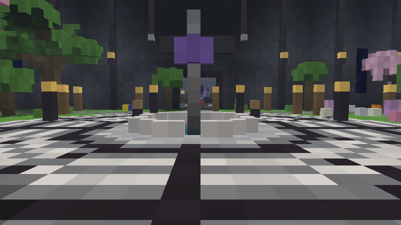 허브 광장 | 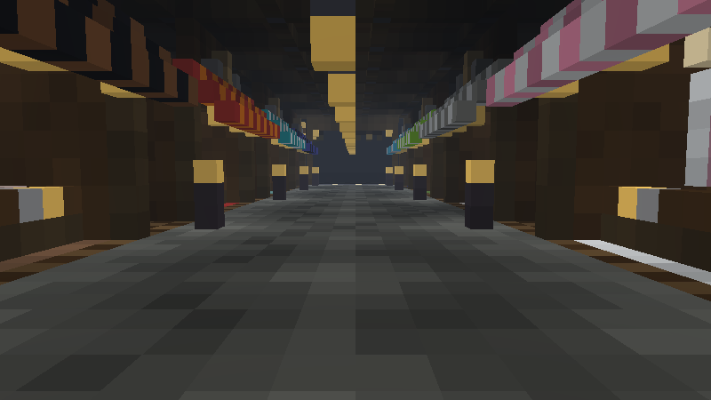 상점 거리 |
| 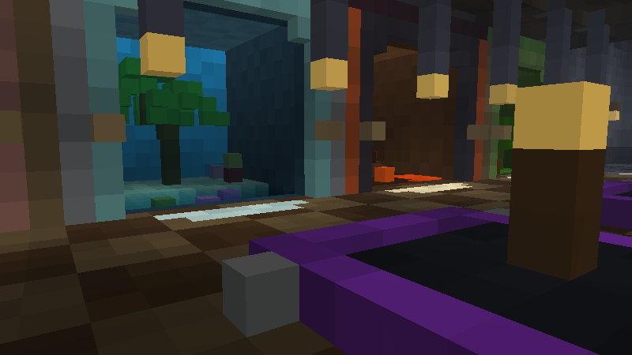 포털 갤러리 | 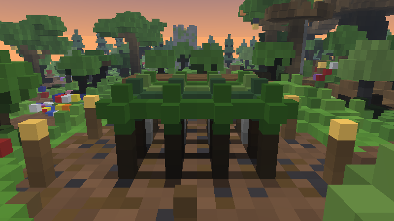 숲 섬 벌목장 |
| 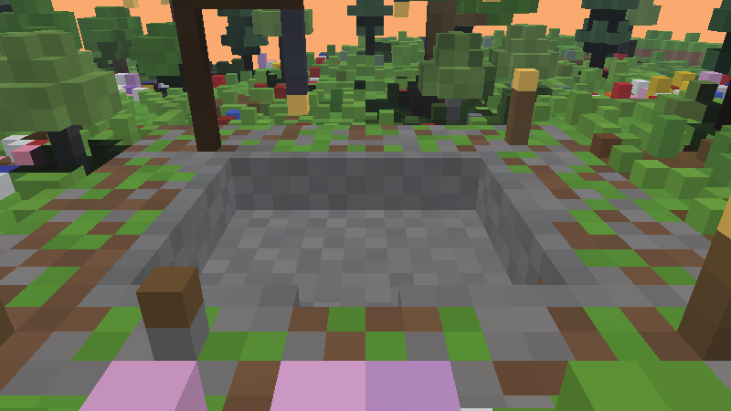 숲 섬 채석장 | 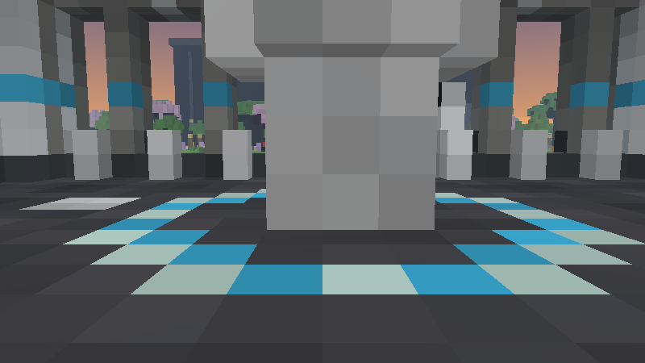 원자로 철광석 |
| 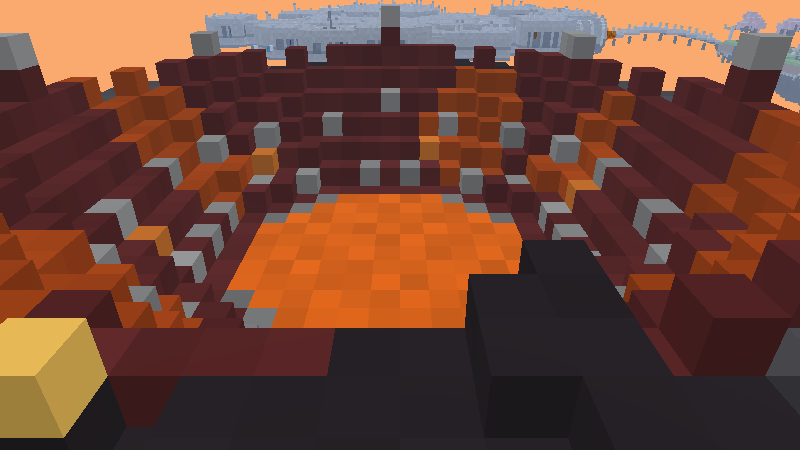 화산 분화구 다이아몬드 | 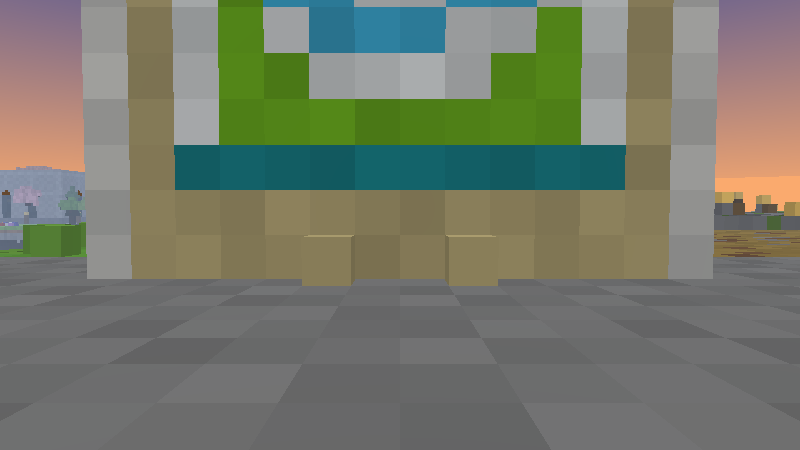 집터 현황판 |
| 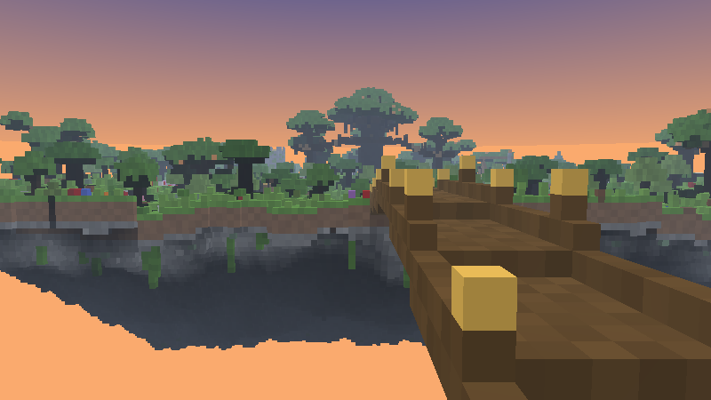 숲 섬 다리 | 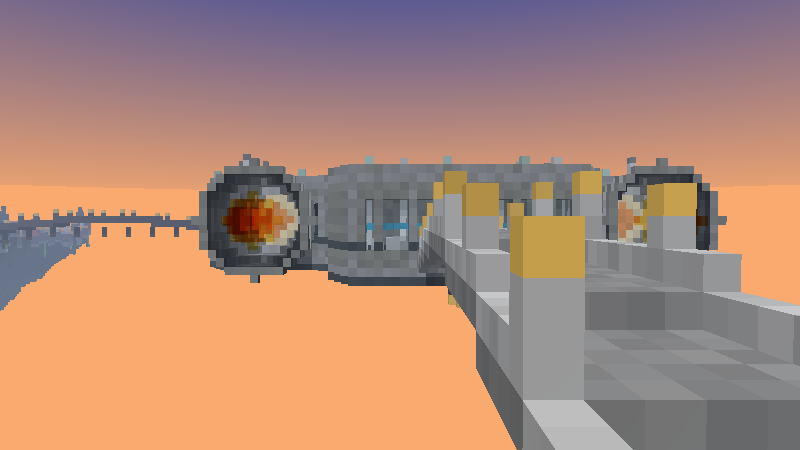 우주 광산선 다리 |
| 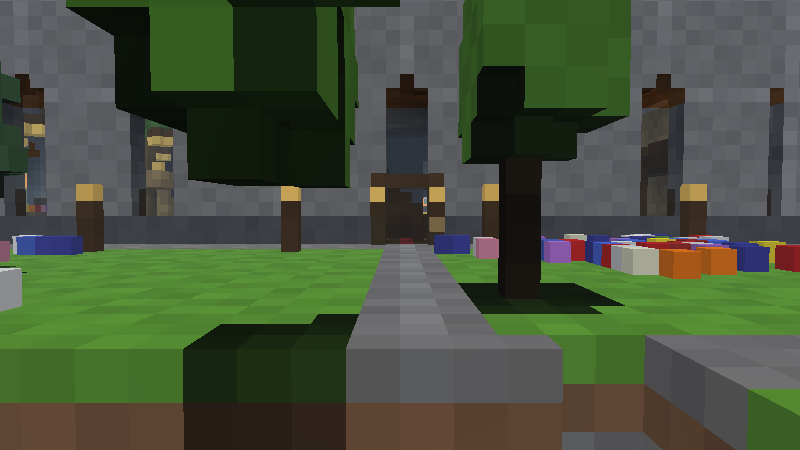 도서관 동문 | 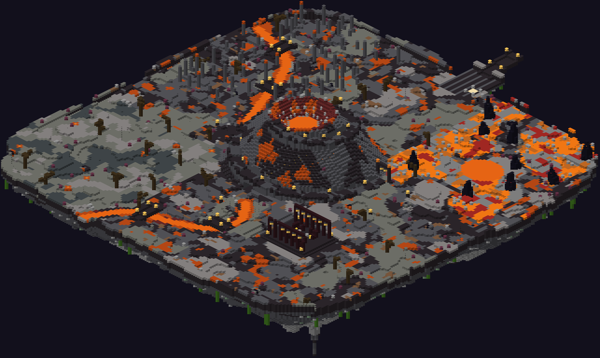 화산 섬 |

섬별 전체 모습: `previews/01_hub.png` ~ `06_library.png`

## 다시 만들기

```
cd generator
pip install -r requirements.txt
python build.py            # SkyGen.mcworld, world_info.json, previews/ 를 한 단계 위 폴더에 씀
python build.py --no-previews
```

- `world_info.json`에 섬 중심, 도착 지점, 생성기 개수, 집터 입구와 가격, 화로방 문, NPC, 엔더 상자, 인첸트 테이블, 포털 좌표가 정리되어 있습니다.
- 규칙 스크립트 원본은 `generator/sky_main.js`이고, 빌드할 때 좌표 데이터가 채워져 행동 팩에 들어갑니다.
- 상점 물건과 판매 가격은 `generator/sky_pack.py`의 `SHOPS`, `SELL`을 고치면 됩니다.
